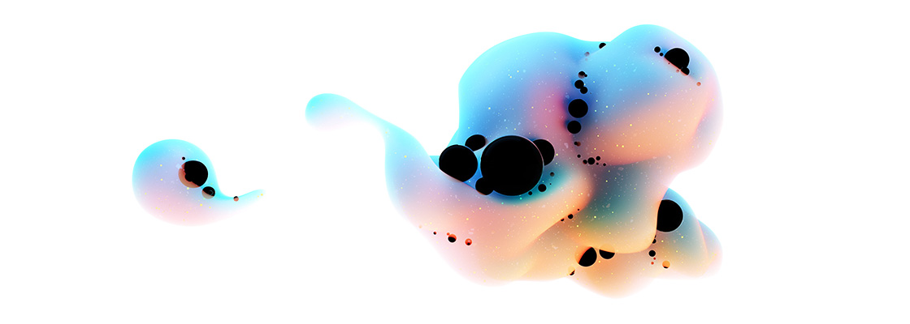

An interesting article outlining a theory about how primordial black holes created shortly after the big bang could account for the "missing matter" that we've been attributing to dark matter. Apparently this is a theory originally pioneered by Stephen Hawking, but fell out of favor when no one was able to observe all these black holes that should be floating around out there.

More recently, the LIGO should be detecting far more black hole colisions if space is full of these primordial black holes.

However, this new theory postulates that the black holes would have formed in clusters of up to a thousand black holes crammed together, with huge black holes at the center, and tiny asteroid-sized black holes around the edge. The clusters explain why we haven't observed these primordial black holes yet, and their orbits keep them from colliding often and explain the low collision rates seen my LIGO.

Apparently if we're able to observe one of these asteroid-sized black holes it would be a huge step forward for this primordial black hole theory, as black holes that small can't be formed by collapsing stars.

It's an interesting, easy to read article, plus it has these absolutely gorgeous illustrations:

I also found [this related discussion](https://news.ycombinator.com/item?id=24576882) on Hacker News about what might happen (or not happen) if one of these asteroid-sized black holes colided with earth very interesting.

> An asteroid-mass black hole would be too small to interact much. It would go straight through the planet, and couldn't possibly capture enough mass to be e.g. captured, but it would register as something like a very high energy cosmic ray.
