On October 29th, 2020, I moved to Canada and established permanent residency. This post is overdue, but I still remember the feelings vividly and want to write it down while I do. This is going to be long and rambling and is mostly written down for my own sake. But I guess if you're curious about my experience moving to Canada, read on!

In early October of 2020, after months of waiting and uncertainty, my Confirmation of Permanent Residence arrived in Caroline's mail. With that, I became eligible to start my new life with my wife in Canada. But let's jump back a year.

*Queue flashback sound effect*

Caroline and I were married in September of 2019 and began the visa process in earnest. We worked with an immigration attorney, Jade Calver of [Calver & Associates](https://www.calverimmigrationservices.com/). Jade's services cost us a little over $5,000 CAD, plus another couple hundred in immigation fees. We probably could have done it on our own, but we consider this money well spent. Jade guided us through the process, made sure everything was done correctly, handled all the communication with the government, and provided reassurance when things were moving slowly.

Along with our marriage certificate, FBI background check, and identification, we were required to submit an abundance of proof of the legitimacy of our relationship, including photos of us together and with family/friends, chat/text message logs, travel history between the US and Canada, and letters of testimonial from family/friends. 

On December 30th, 2019, we finally had everything ready and submitted my application for permanet residence to IRCC (Immigration, Refugees, and Citizenship Canada). What should have been a two month process ended up taking ten months. The timeline was as follows:

- January 16, 2020: Notified that application was accepted and being processed.
- Jan 31, 2020: Requested by IRCC to submit fingerprints. I was able to get this done at the local sheriff's office, and they were able to submit them electronically.
- Feb 3, 2020: Requested by IRCC to submit medical examination within 30 days. This had to be done by an approved physician. 
- Feb 13, 2020: Had my physical, bloodwork, and chest X-rays done by a walk-in clinic in Thunder Bay. The walk-in clinic did the physical and told me where to go for the bloodwork and X-rays. They then compiled the results and sent them to IRCC. Despite not having Canadian health coverage at this point, the whole thing cost me less than $200.
- Feb 29, 2020: After some back-and-forth with the clinic (they're very busy folks) and some delays receiving the X-rays from the radiologist, the medical examination was finally received by the IRCC.
- Mar 20, 2020: IRCC requested a copy of my American passport as well as photos for my permanent resident card within 30 days, which meant that my application was approved! 
- Mar 31, 2020: Mailed above to IRCC. At this point, amidst COVID ramping up and the Canadian border closing imminently, I had gone to Thunder Bay to stay with Caroline indefinitely (max 6 months under a regular tourist visa) and was working remotely. Because of this, we put Caroline's address down to mail my documents to when issued, thinking that I might still be there by the time my COPR (Confirmation of Permanent Residence) was mailed.
- Apr 2, 2020: Tracking indicated that above had been delivered to IRCC. All that was left at this point was for them to issue my COPR (confirmation of permanent residency), and I would be good to move to Canada! Typical turnaround time is 4 - 6 weeks, but our attorney indicated that with reduced staffing due to COVID it could be longer.
- May 4, 2020: Nothing.
- May 29, 2020: Nothing. Jade indicated that her other clients weren't hearing anything either.
- June 20, 2020: Received communication from IRCC indicating that they had not received my documents, despite tracking showing that they had arrived beginning of April. Jade wasn't surprised by this knowing how backlogged they were and advised just waiting for them to sort it out. By this point, I had had to return to the States for unrelated personal reasons.
- July 15, 2020: Still nothing. Jade recommended resending my documents, which meant getting my passport photos retaken&mdash;not a trivial feat when the nearest location I could get them done was at a Walgreen's in Duluth, two hours away.
- Aug 5, 2020: Received communication requesting confirmation of current mailing address, **indicating that they were ready to mail my COPR**! With the difficulty of getting my passport photos re-done, as well as other personal things going on, I had *not* resent my paperwork by this point. Jade indicated that I did not need to, since they evidently had received my paperwork after all.
- Sep 18, 2020: Nothing since last. Jade said that only some applications were making it through, most were on hold.
- Sep 23, 2020: **Received request from IRCC to submit passport copy and photos within 30 days.** This was disheartening, as this was exactly the same request that we originally received from them on March 20th. This indicated that they had lost my submitted documents after all.
- Oct 2, 2020: Still hadn't resent my passport photos. Lots of confusion of how to properly mail it from the States, and lots of back-and-forth with Jade's colleague (Jade was on parental leave at this point).
- ALSO Oct 2, 2020: MY COPR ARRIVED IN THE MAIL AT CAROLINE'S, COMPLETELY OUT OF THE BLUE!! IRCC *had* received and processed my originally submitted photos, despite indicating that they had not. I was eligible to move to Canada! Along with the COPR came a letter explaining that the COPR was not valid for travel, given that the border was still closed due to COVID, and that I would have to wait to enter Canada and establish residency until I was permitted to cross the border. However, this wasn't a problem&mdash;they were letting spouses of Canadians cross the border, so I was still able to enter. With the uncertainty of COVID, and knowing that could change without warning at any time, I wanted to cross the border as soon as possible. I notified my employer that I would be moving to Canada and working remotely and gave notice on my apartment.

And this brings us to the month of my move. There were a ton of logistics to deal with in October, including making a trip south to visit my parent, selling my car, packing up, figuring out import of my motorcycles and firearms (and house plants!), renting a uHaul, etc. I took the last four days before my scheduled move off work to finish packing and cleaning, but even so, it was an insanely stressful four days. I felt close to nervous breakdown at times, not thinking I was going to have everything ready to go in time.

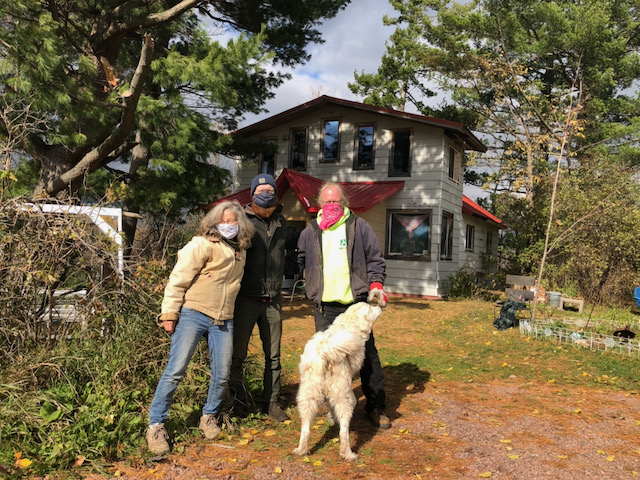
*Last visit with my parents*

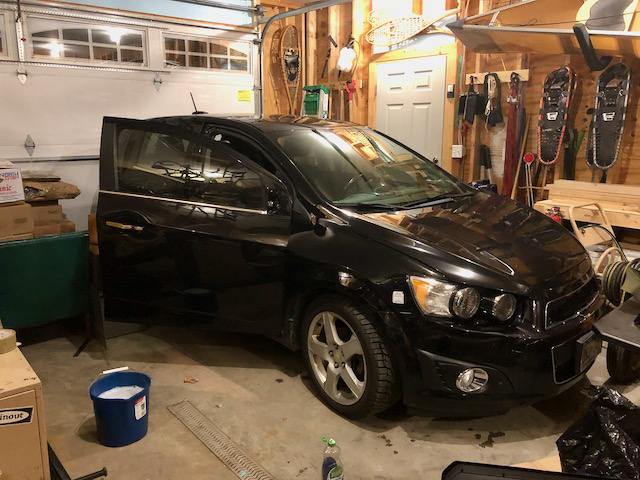
*Giving the Hedgehog a thorough cleaning before selling*

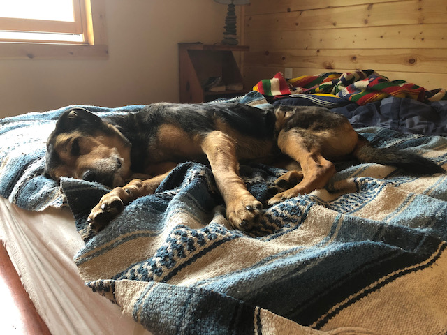
*The sweetest girl*

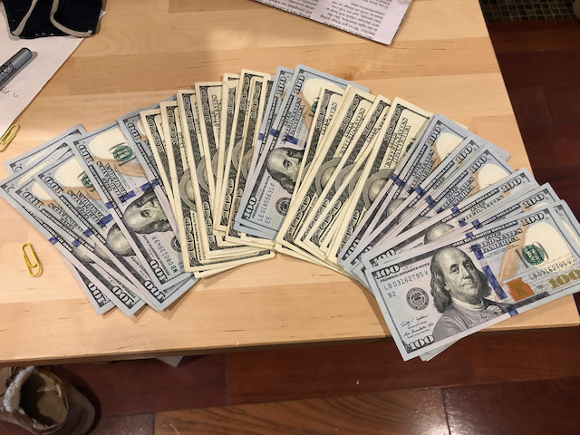
*Feeling like a drug dealer after selling my car*

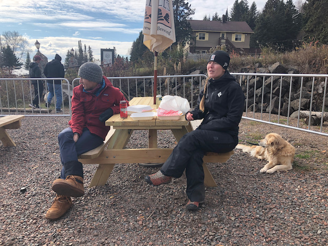
*Last visit with Marika, Biagio, and Lily*

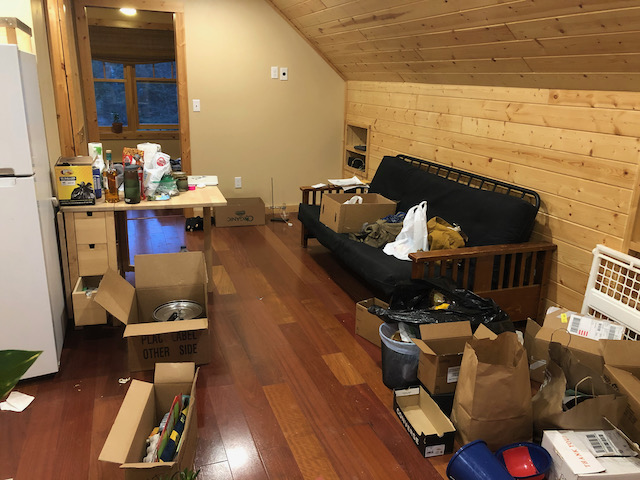
*T-2 days. This is when the stress got real.*

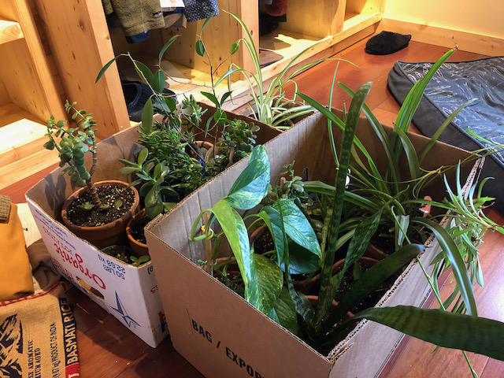
*Boxes of plants. Fun facts: you're allowed to bring up to 50 houseplants across the border with you; you must personally accompany them across the border; and they must not be plants that are able to live year-round in Canada. I may have [cheated slightly](/misc/plant-tour/hen-and-chicks/) on the last point, but they didn't check.*

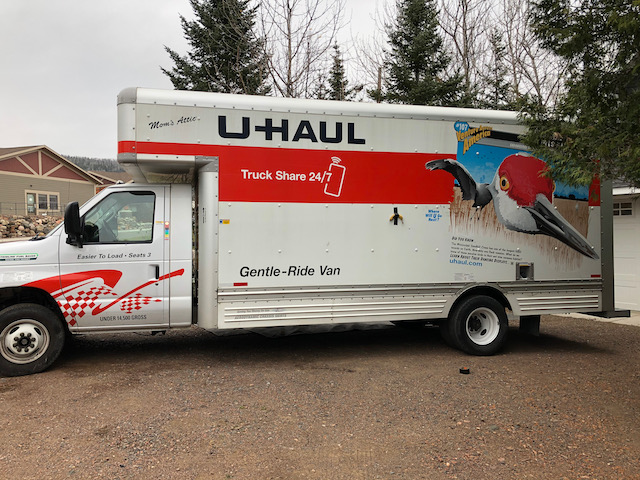
*This is a big fucking truck. Banana for scale.*

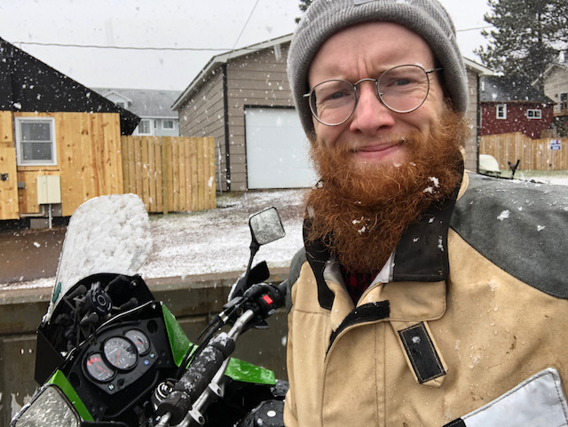
*Having sold my car, did some final errands on my bike in a blizzard. Could see very little once my helmet visor was covered with snow&mdash;would not recommend.*

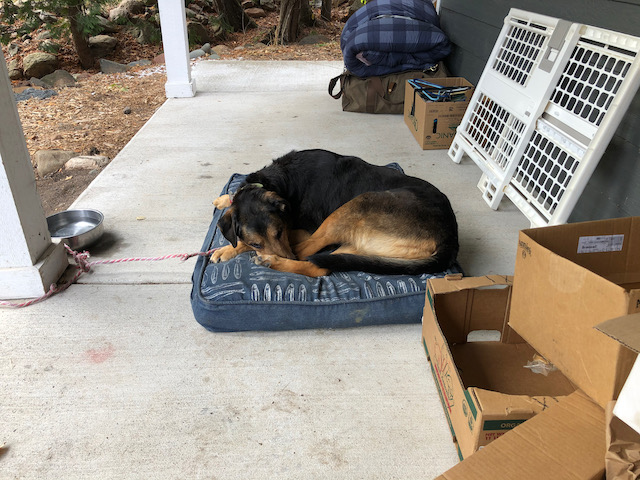
*Tawny being exceedingly good and patient on the final, and most stressful, day.*

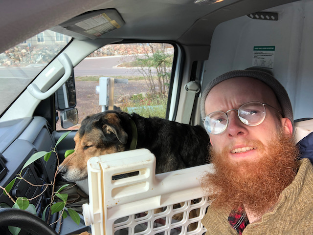
*Finally in the truck!*

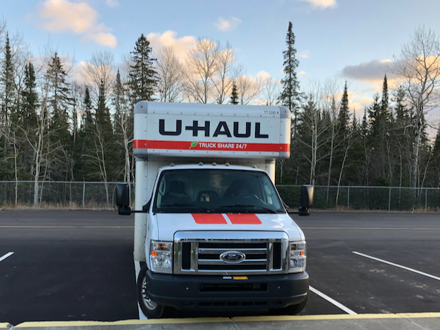
*At the border!*

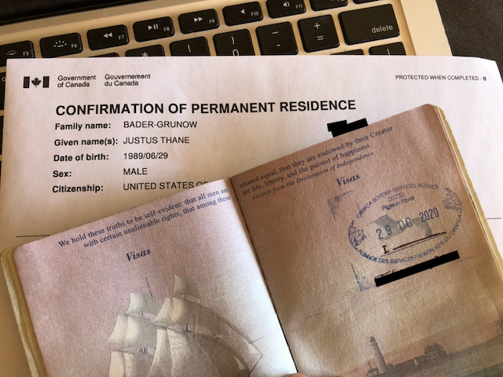

But I did, and on October 29th I loaded the last of my stuff and our sweet elderly blind doggo Tawny into the 26' uHaul, made one last stop at the dump, and got on the highway north.

The 45 minutes between Grand Marais and the border were excruciatingly exciting and nervewracking. Everything was in order, the entirety of my belongings were itemized on a printed spreadsheet, and my wife was waiting at the border with my documents. On the other hand, all of my belongings were packed into a uHaul, I had moved out of my apartment, and there's no law that says they *have* to let me in&mdash;especially with COVID. They could turn me away if they wanted to, and what would I do then?

Everyone at the border was so friendly, my wife was there, they were so impressed with my inventory of belongings that they didn't even bother looking in the uHaul, and the border guard shook my hand when he welcomed me to Canada&mdash;just like a movie.

In the subsequent months, I've moved twice, landed my ideal job, got my Ontario driver's license, health card, and permanet resident card. As I'm writing this five months later, the border is still closed, COVID is still not under control here (but I get my first vaccination in nine days!), Caroline is living 600 miles away until she finishes her contract in November, and I haven't crossed back into the States or seen my family or friends since moving, but I am still so excited and feel so fortunate to finally be here. 

O Canada!
