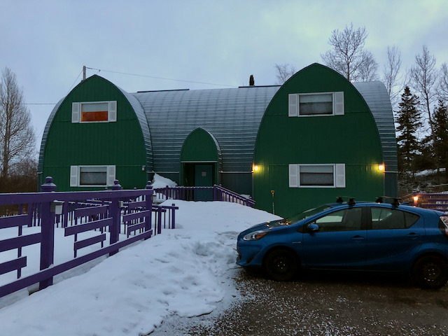
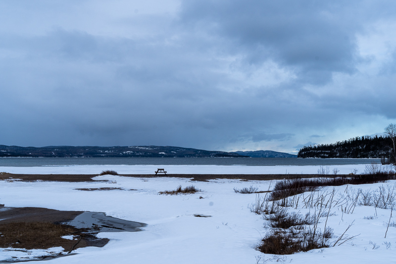

Caroline and I took a mini vacation to Rossport, two hours east of here, this past weekend.  With Caroline being in the process of growing a tiny human and all, she was looking for a pretty relaxed weekend. That works for me, since she usually wants to do more than I do and I'm pretty content to lounge around.

We arrived Thursday night and settled into this wonderful and funky little room at [Serendipity Gardens](http://www.serendipitygardens.ca/) Guest House:

Rossport is tiny, so despite the guest houses being on the "outskirts", it's about a two-minute walk to "downtown" and the marina. 

On Friday we followed a little trail from the guest houses that the proprietor had told us about. After a very short hike, it lead us to the lovely Little Lake nestled in the woods. At first we thought the trail ended at the lake, but keen-eyed Caroline spotted pink flagging tape marking a trail clockwise around the lake.

After about a kilometer (which took us 40 min---the snow was DEEP, and even with snowshoes we were constantly breaking through to knee-depth) we reached a little overlook where the trail seemed to end. We stopped and picnicked, and then turned around.

After getting back to where we started, keen-eyed Caroline spotted another trail, this one going the opposite direction around the lake. We followed that one a ways until it again seemed to end, and turned back.

Looking at our GPS track afterwards, we realized that we had *almost* circumnavigated the lake afterall, and the two trails probably did connect. 

Oh well! All in all, it was a lovely little snowshoe on a beautiful day.

In the afternoon, we took a walk through town and followed the road onto Nicol Island---a picturesque little island with vacation houses and nice views of the lake and surrounding islands.

For dinner we had leftover orange sweet potato soup with spicy cumin granola and assembled a smoked salmon salad:

Both delicious.

Saturday morning, we went for a run through town. Caroline wanted to get 12 miles in as training for our upcoming half-marathon, but considering Rossport is basically consists of a single street along the water and a short spur road onto the aforementioned Nicol Island, it ended up being three out-and-backs from the hotel to the end of the island.

<iframe height='405' width='590' frameborder='0' allowtransparency='true' scrolling='no' src='https://www.strava.com/activities/6992058849/embed/b350b54d9b275adc466b58bc69c44b53bdf2b2f9'></iframe>

I bailed after the first two laps as my hip has been bothering me, but Charlee stayed with Caroline the whole time---his longest run yet!

After lunch, we drove to Terrace Bay, about 30 min further east, to check out Aguasabon falls.

We also visited the town beach, where we learned (and maybe Charlee learned) that Charlee is afraid of waves:

Caroline tried demonstrating that waves aren't scary:

On the road to the beach we also discovered this really wild and rundown old building:

I'd love to know what this building was. Terrace Bay was established as a company town in the 40s for a paper mill so there would have been lots of worker housing, but I can't imagine the company would put that much effort and creativity into a building like this just for housing workers. Perhaps some enterprising entrepreneur thought Terrace Bay would be a hot tourist destination and built it as a hotel?
