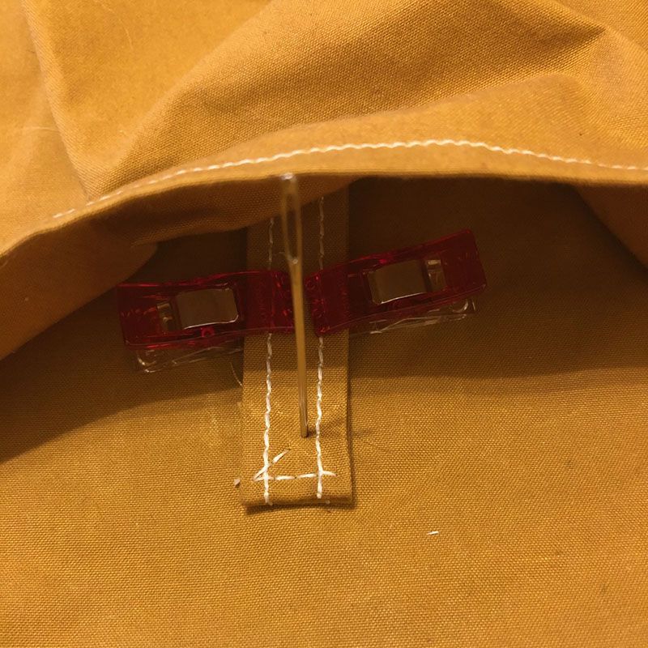
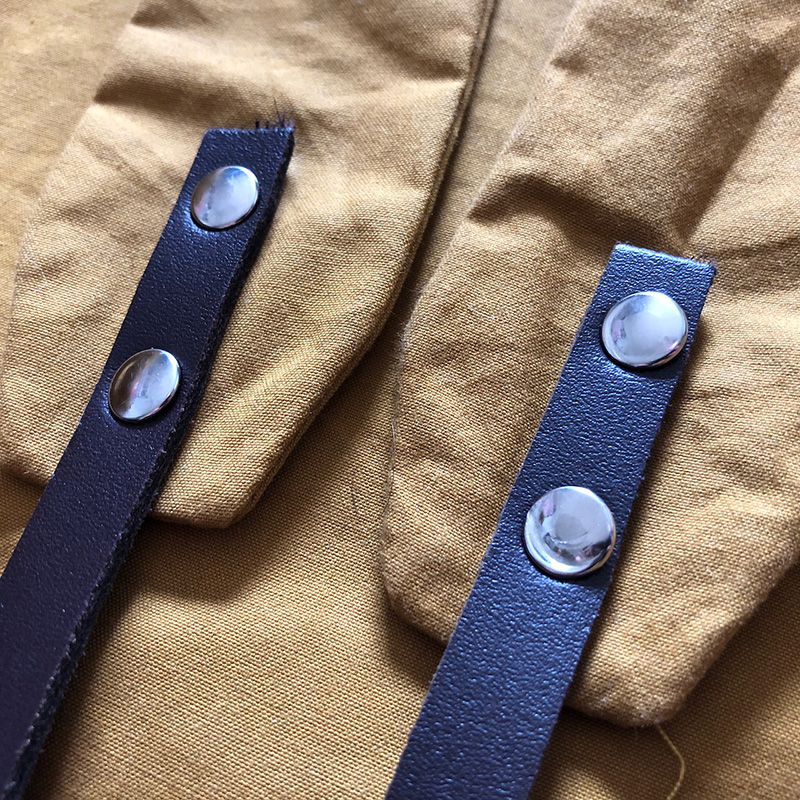
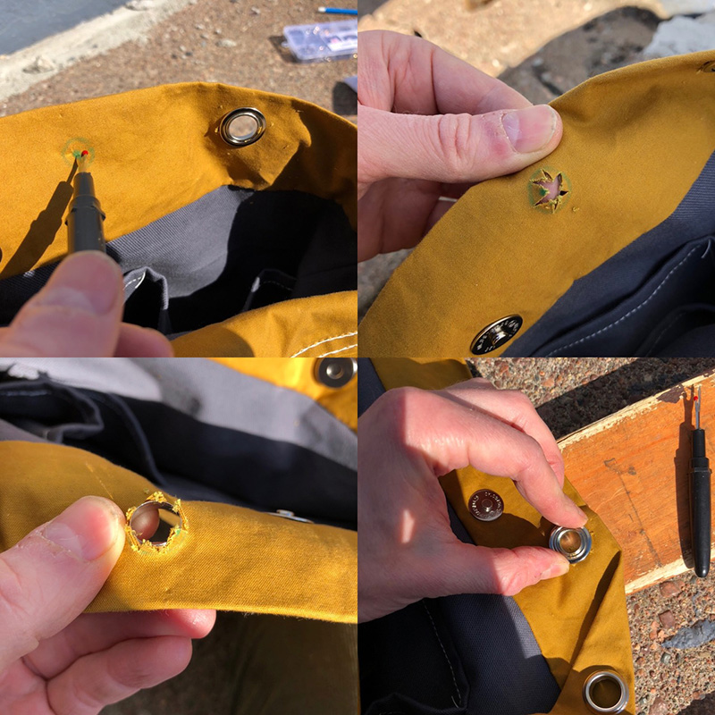
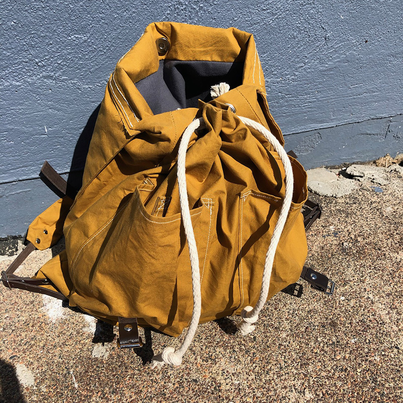

I just finished making the Merchant & Mills Right-to-Roam rucksack, [which is available as either a pattern](https://merchantandmills.com/store/patterns/right-roam-rucksack/) or a [kit](https://merchantandmills.com/store/gifts-2/kits/rtr-rucksack-kit/). I purchased the kit.

Merchant and Mills stuff can be difficult to find online in the US. [North House Folk School](https://northhouse.org)'s School Store carries Merchant & Mills products---you may be able to get it by contacting them. 
[[toc]]

## The kit

The pattern is labeled intermediate, and I think that's probably accurate. The instructions are clear and easy to follow, for the most part. There are only a few bits that might be frustrating for a beginner to figure out.

The kit supplies the materials needed; you still have to do all the prep work yourself (measuring and cutting the fabric, cutting the leather straps, assembling the buckles, etc). There are a few things that the kit doesn't include:

- Thread. I used a heavy duty nylon upholstry thread for strength and a jeans needle
- Leather shears for cuttting the straps to length
- Rivet setting tool
- 2 and 3mm hole punches

## The process

The process detailed below is by no means comprehensive. I'm only noting parts of the process that I took photos of, which, in general, are only parts that I found interesting and/or instructive.

### Adding the front pockets

This is one of the trickier parts because the pockets are three-dimensional with these pleats in the corners. I didn't immediately understand the instructions for sewing around the corners reading ahead, but it made sense when I was actually doing it. Just take it slow and it's pretty easy.

Note the [Wonder Clips](https://www.joann.com/wonder-clips-50-pkg/11490935.html). This oilskin (and waxed canvas in general) tends to show pin holes, so I tried to avoid pinning where possible, or placed my pins strategically otherwise.

### Sewing the pocket corners

I was sewing with an entry-level Singer machine, and while it did pretty well overall, it didn't like dealing with more than three or four layers of the oilskin. Because these reinforced pocket corners are hemmed and then folded over, there are...seven layers if I'm doing my math right. The machine made it through on the first pocket, but the machine really wasn't happy, and the stitches weren't great, so I handstitched the corners on the second pocket. I used backstiches, which look like a machine stitch on the right-side I free-handed the first corner, which was difficult and turned out sloppy, as you can see above. The next corner, I used a thicker sewing needle as an awl to prepunch each hole from the right side. Much easier and neater.

### Adding an extra little key loop

The kit comes with plenty of extra fabric, which is nice! I decided to add a little key loop in one of the outside pockets. I machined sewed the little strip of fabric, and then handstitched it to the bag using the same pre-punch and backstitch technique as above.

### Reinforced strap attachment

The instructions only say to do one line of stitching when attaching the straps. I reinforced it a bit for extra strength.

### Inserting the lining, and magnetic fasteners

Inserting the lining into the bag. I'm doing this wrong, as we'll discover in a second. 

Note the magnetic fastening---the instructions aren't super clear on the best way to attach this, and after a little experimentation I think it works best to bend the metal tabs to the outside (rather than inside). Also note that the facing washer is slightly cupped, and the concave side should be down.

### Oops!

Oops! When finally sewing the lining into the bag, I sewed the lining in inside out. It's pretty confusing because you put the lining inside the bag, stitch them together, and then reach inside and pull the whole bag inside out through a hole in the lining. The instructions aren't super clear on that part, and my brain is bad with geometry problems. It turns out when the instructions say "insert the lining into the bag, right sides together", they mean right side of lining facing right side of bag, *not* right sides of the lining facing each other.

I had to rip it out and sew it again. No harm done.

### Bad rivets

Some of the rivets went on pretty nice, and others...not so much. I'm not super practiced with rivets so I'm not entirely sure why, but I think that the supplied rivets are too long in most cases, causing them to bend easily when hammering them down. [See below](#reinforcing-the-rivets) for possible solution to this...

### Topstitching the top flap

Topstiching the flap (which also helps secure the shoulder strap) was another place my poor little machine struggled hopelessly. I ended up ripping out the failed attempt (notice the holes left behind) and handsewing it, again using the pre-punching-and-backstitching-technique. This was by far the most time-consuming part. I need to get a walking-foot machine.

### Reinforcing the rivets

I'm concerned that some of the rivets could eventually tear through the fabric, especially the handle rivets at the top. I had the idea to reinforce them with a bit of extra leather from behind, but unfortunately I had already done most of them by the time I thought of it. Oh well, it will be an interesting experiment to compare how they hold up over time! 

I would recommend doing this on all the rivets. This also helps with the supplied rivets being too long.

### Installing the grommets

I marked the position of the grommets by placing the inner ring where it belonged, tracing the inside of the ring, and putting a little dot in the middle like a bullseye. I then poked a hole in the middle with my seam ripper, and used the tips of my scissors to snip out to the *outside* of the circle in a star shape. I inserted the grommet from the *right* side, placed the ring, and hammered it down.

### Additional flap rivets

I added a couple of additional rivets to adhere the flap to the straps and make it lay a little neater.

## Impressions of the finished bag
The finished bag has very little structure of its own---in fact, it reminds me of those [drawstring backpacks](https://duckduckgo.com/?q=drawstring+backpack&t=ffab&iar=images&iax=images&ia=images) (although certainly more comfortable!). I also am a little bit concerned about losing things out of the exterior pockets. If I had thought about it ahead of time, I would have added little snap cover flaps, which would have been easy to do with the extra fabric.

Overall though, it's a gorgeous bag and building it has been a great learning experience. I think I'll get plenty of use out of it! I'll update this page with with more on how it holds up over time.

