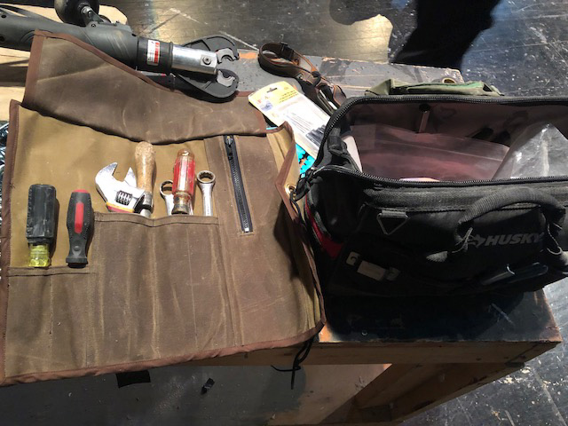
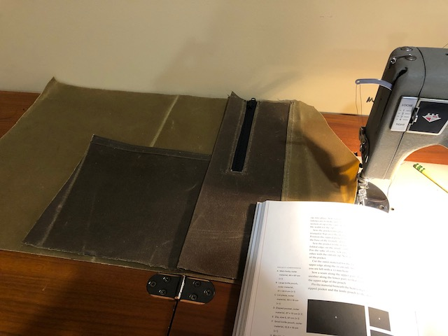
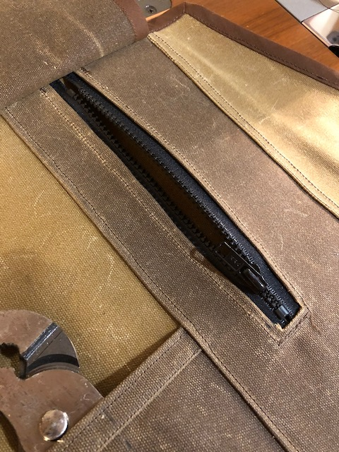
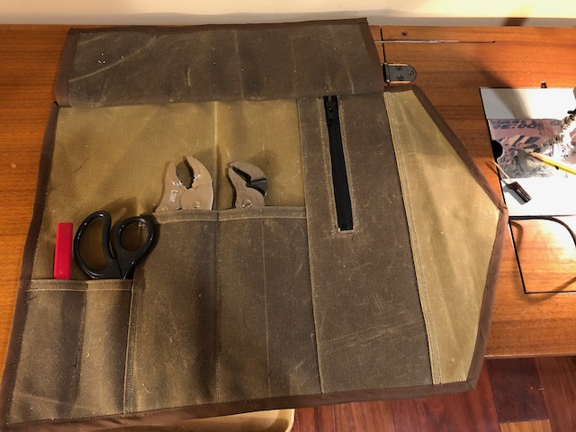
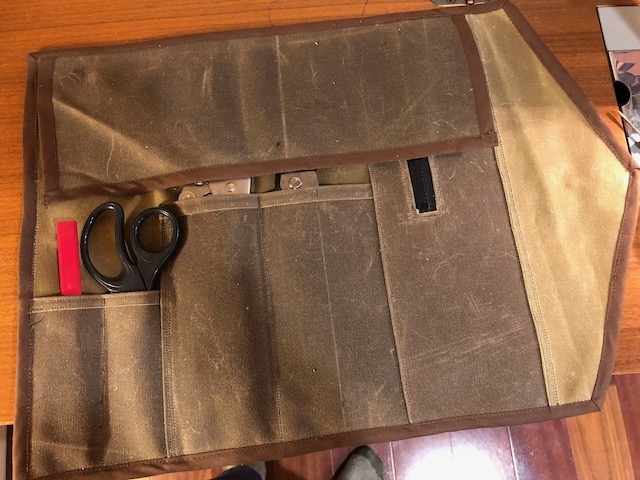
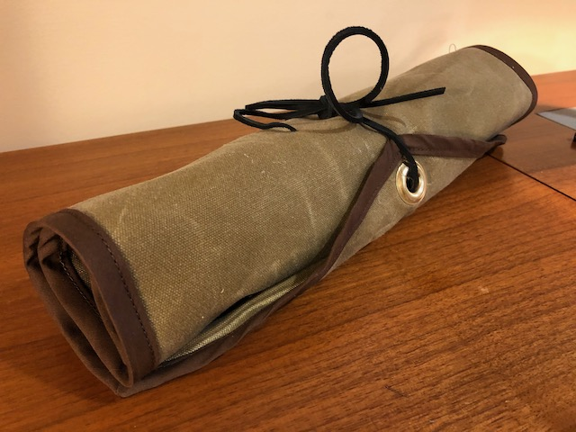

I made this waxed-canvas tool roll for Dad last Christmas. It's based on a knife roll from the book *Heavy-Duty Sewing* by Anton Sandqvist, with some modifications: particularly an extra layer of canvas to hide the pocket stitching and a different closure.

It was a really fun and easy project---I highly recommend working with some lightweight waxed canvas if you can. It's a joy---it's easy to crease and stays folded once you fold it.

I also made it 100% with things I already had on hand---I didn't buy anything new for it.

Unfortunately I don't have many progress pics or notes on this one.

Laying out the pieces.

The only bummer is the only zipper I had on hand was too short, and it turns out this pocket is almost completely unusable.

Flap up for tool access.

Flap down to keep the tools in place when rolled up.

Rolled up and fastened!
