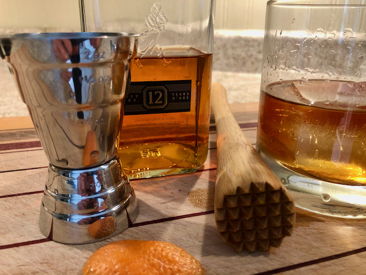

--- 
title: Whiskey Old Fashioned
date: 2021-05-22
tags: cocktail-recipes
thumbnail: oldfashioned_thumb.jpeg
---
An old fashioned is the staple cocktail of my home state of Wisconsin, and it's a fun one to order in different bars because everyone makes it slightly differently. One of the best I've had was very clean and simple, and garnished with a green olive. Another contender for the crown used black walnut bitters and was garnished with a cinnamon stick.

The recipe below is very simple and is my go-to at home.

## Ingredients
- 2oz whiskey, preferably something robust/spicy
- 1tsp maple syrup
- orange peel
- Angostura bitters

## Method
- Muddle orange peel, maple syrup, and 2 - 3 healthy dashes of bitters in glass. Add whiskey and stir. Add large ice cube. Optionally finish with a splash of club soda.
