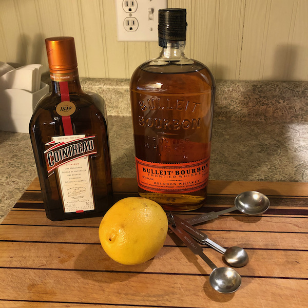
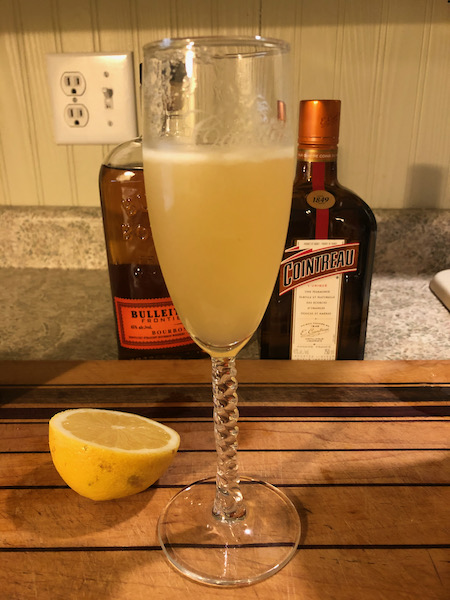

--- 
title: Bourbon Sidecar
date: 2021-05-22
tags: cocktail-recipes
thumbnail: sidecar_thumb.jpeg
---
If I had to pick my single favorite cocktail to make at home, it might be the bourbon sidecar. The sweetness of the bourbon comes together with the zing of fresh-squeezed lemon juice and the complexity of Cointreau, and combines in a wonderfully layered cocktail that is just sweet enough without any added sugar. 

Between the bourbon and the Cointreau, this one packs a punch in the alcohol department.

## Ingredients
- 2 oz bourbon (I like Bulleit---it's sweet enough to pair with the lemon)
- 1 oz Countreau
- 3/4 oz fresh-squeezed lemon juice

## Method
- Shake all ingredients with ice, strain into a martini glass.

