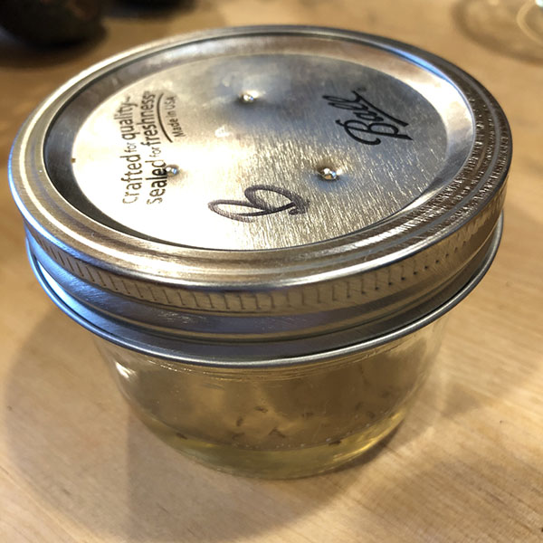

To make the most effective DIY fruit fly trap, use a hammer and a small nail to poke a few tiny holes in the lid of a Mason jar. Put a little bit of some sort of sweet vinegar in the jar. Apple Cider vinegar is the gold standard, but I've used sweet rice wine vinegar with good results as well (I also added a bit of honey to sweeten the deal). Add a drop of dish soap to break the surface tension and facilitate the drowning of the fruit flies.

# Comments

Have you conclusively proven a better method? [Email me](jg@justus.ws)!
