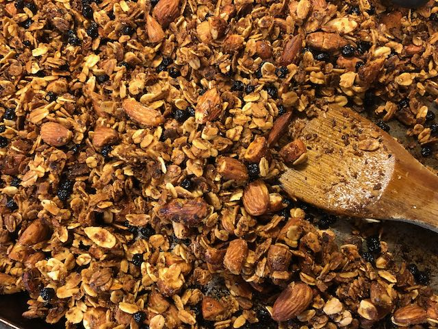

Adapted from Better Homes & Gardens New Cook Book.

# Ingredients
- Two cups regular rolled oats
- 1 cup chopped or slivered nuts (almonds, cashews, or other)
- 1/4 cup wheat germ
- 1/4 cup flax seed meal
- 2 Tbsp canola oil
- 3/4 cup honey
- 3 Tbsp ground ginger or cinnamon (or both)
- 1 cup dried fruit (blueberries, mango, goji berries---whatever you like!)

# Instructions
1. Preheat oven to 300F
1. Put oil in small pan over medium heat, stir in ginger
1. When heated and aromatic, stir in honey, keep on heat until liquid
1. Stir together oats, nuts, wheat germ, and flax seed meal in large bowl
1. Stir in honey mixture until combined
1. Spread on greased cookie sheet, bake for 20 min, stir, bake for another 10 min.
1. Remove from oven, stir in dried fruit, and allow to cool. Granola will be soft when warm, but should be completely dry once cooled. If it's still soft or moist, pop it back in the oven for a few more minutes.
