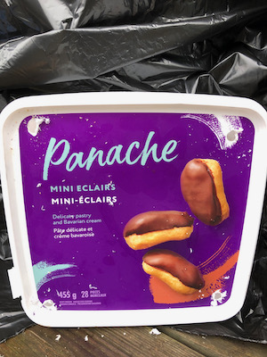
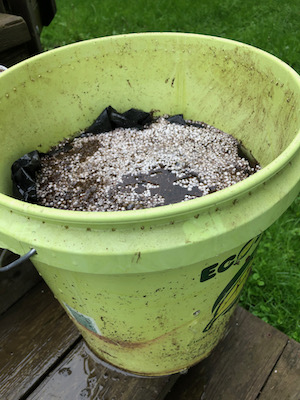

If you have limited outdoor space (a patio? a rented yard you can't dig up?) bucket gardening is an excellent option. They're also convenient to move around if you have limited sun, they're cheap to make, and the self-watering ones that we're making here only require watering once per week or so. They save time, money, and water!

Most of the information here is based on [this video](https://www.youtube.com/watch?v=mRhLZM-cJZ0) from Internet Shaquille, and the delightful videos from [Gardening With Leon](https://www.youtube.com/channel/UCSDYs9sd2_BlLuWSiEr7TJQ)[^1] which Shaq's video is based on, with my own tweaks added.

## Contents
[[toc]]

## The theory

The basic idea is to create a reservoir of water in the bottom half of your planter, which will be wicked up as needed by the potting mix. This is done by placing a smaller container inside the planter. The smaller container has to be perforated (or at least have holes at the top and bottom) which will allow water to flow in and out, while keeping the dirt (mostly) out.

## Supplies

For each planter you'll need:
- A 5 gallon bucket
- Some sort of smaller container(s) to go inside it, totalling around two gallons. I used [these](IMG_8142.jpeg) perferated two gallon buckets that I found at a garden centre, but almost anything will work: two liter pop bottles, several beer cans, etc. If they're solid, drill a bunch of holes in them.
- 16" or so of 1-2" PVC (optional, but recommended)
- A drill or some other way to make holes roughly 5/16" or so

Note that all of these supplies can be hugely improvised: as an example, I made one using a 5gal bucket that was already full of holes and [nothing but a bunch of garbage](#making-a-planter-out-of-garbage).

Additionally, you'll need:
- Potting mix (must be potting *mix*, *not* potting soil! Potting mix consists mostly of peat moss and vermiculite, and is very absorbant. Soil/dirt will not wick the water properly. May also be called growing mix or growing medium).
- Perlite (optional)
- 5-5-5 fertilizer or thereabouts, *not* water soluable. The exact numbers aren't too important. 5-6-5 is fine. 5-10-10 is fine. Whatever you can find with similar numbers[^2].
- Water soluable fertizer high in nitrogen, which is the *first* number in the sequence. *20*-20-20 is fine.
- Water soluable fertilizer high in phosphate (the second number), such as 10-*55*-10 (needed for fruits and veggies, but not needed for leafy greens or herbs).

The fertilizers are crucial because unlike potting soil, potting mix doensn't contain nutrients.

## Assembly

1. Cut your PVC pipe to 15" or so, cutting one end at an angle as so:
  
  The purpose of the angle is to prevent the bottom of the pipe from sitting flush at the bottom of the bucket. If you don't have the ability to cut it, you could also just drill holes in the bottom of the pipe.
2. Place your inner container upside down at the bottom of your 5 gallon bucket, and add the PVC pipe next to it:
  
  If you're using an inner container that's not already perferated, such as 2-liter pop bottles, make sure to drill some holes in it, at least at the very top and bottom. See my [trash planter](#making-a-planter-out-of-garbage) for an example.
3. Drill a hole in the side of the 5 gallon bucket an inch or two *below* where the top of the inner bucket will be. This will function as an overflow hole---when water your planter, you'll fill it until water comes out through this hole. Placing it below the top of the inner reservoir provides some air space for the roots, which your plant also needs. You'll want to drill the hole near where your PVC pipe is located so that when you're watering you can easily keep an eye on the drain hole.
  
  In the picture above, I've placed the inner bucket next to the 5 gallon bucket to place the drain hole.
4. If you have perilte, add it to the top of the inner reservoir. If not, just use potting mix instead. The benefits of using perlite in this step are that it helps keep water out of your inner reservoir, it allows more space for water in the bottom of your planter, and it's a bit cheaper than potting mix. It doesn't matter a whole lot though.
  
5. Add just enough potting mix to cover the inner reservoir by another inch or two, and moisten it with water.
  
6. Add 1/4 to 1/2 cup of your 5-5-5 *non water-soluable* fertilizer.
  
7. Fill the rest of the bucket up with potting mix, and water it thoroughly. This is the only time you'll water the planter from the top, but the potting mix needs to be moist to start the wicking process.
  
8. Plant your beautiful little plant(s)! All the ones I've done so far have been starts, but there's no reason you couldn't plant seeds directly. For larger veggie plants like tomatoes, squash, melons, peppers, etc, you'll want to just do one per bucket. For herbs or lettuce, go wild!
  
9. Mix 1tsp of the water-soluable high-nitrogen (20-20-20 or such) fertilizer per gallon of water, and add water via the PVC pipe until it runs out through the drain hole. 
  
  You're done!

## Care

How much water your plants will consume depends on your climate, the size of the plants, etc, but you'll probably only need to water once a week or so (although you can water as frequently as you want, it won't hurt!). You do want to make sure not to let the bottom reservoir run completely dry---if the mix dries out, it won't wick new water up. Each time you water, mix in 1tsp of water soluable fertilizer per gallon of water.

Once your veggies flower and start growing fruit, switch from your high-nitrogen to your high-phosphate fertilizer. Nitrogen supports leaf growth, and phosphate supports fruit growth.

## Progress pics
### Three weeks

## Making a planter out of garbage

This project is very forgiving---you can make do with almost any materials, or without most of them. As an experiment, I made one using an old 5 gallon bucket that had a bunch of holes in the bottom (leftover from a worm composting project) and used some garbage for the inner reservoir. I ommitted the PVC and the perlite, and as an experiment I also left out the initial fertilizer---although I'm still adding fertilizer to the water.

1. Drill holes in the garbage to allow water in:

2. Cut a garbage bag to the right height to extend to the top of your inner garbage (this is only necessary if your bucket is full of holes like mine---it functions as a liner to contain the water):

3. Put the garbage in the bucket:

4. Cover it with potting mix:

5. Make sure the liner doesn't obstruct the drain hole:

6. Fill the reservoir (i.e. garbage) by adding water until it runs out the drain hole:

7. Fill the rest of the way with potting mix, plant your plant, and thouroughly water!

Without the PVC fill pipe, you just add water by pouring it on the dirt at the top. The only real disadvantage is it's more difficult to determine when exactly it's full---because the water is running down to fill up the reservoir, it might run out of the drain hole before the reservoir is full. You'll want to add water until it comes out of the drain hole, wait for it to finish draining, and then add more water until it again comes out of the drain hole. It works fine though, and my garbage tomato seems to be just as happy as the rest:

[^1]: I love these videos so much. Leon even includes his phone number at the bottom of each video in case you have any questions: 580-564-5909. Give him a call! I did.

[^2]: A very quick primer on fertilizers, since this was all new to me. You'll see fertilizers labeled with something like "5-5-5" or "2-3-1". In general, fertilizers contain three crucial nutrients: nitrogen, phosphate, and potassium. The amounts of each of these that the fertilizer contains is indicated by those three numbers in order: nitrogen, phosphate, and potassium (or "NPK"). So, a fertilizer labeled "2-3-1" contains 2% nitrogen, 3% phosphate, and 1% potassium.
