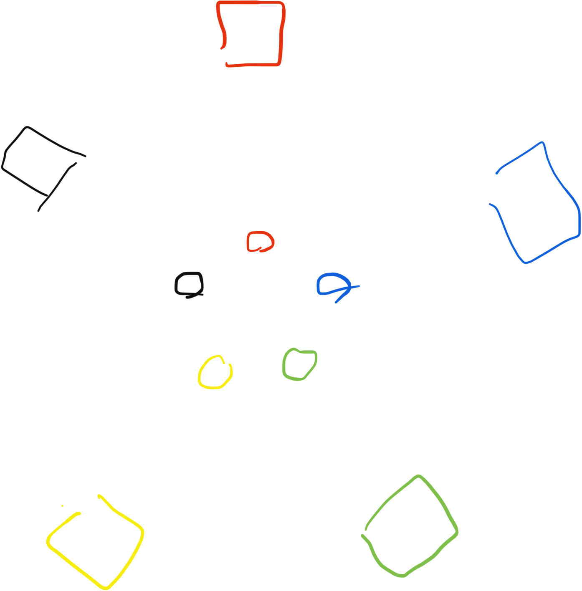

### Also Known As: Hit The Can; Everyone Must Get Stoned

- For 2 - 10(?) players
- Best played in a gravel driveway

Marika, Biago, and I were relaxing with lawnchairs in the driveway with a couple of beers when we accidentally invented a drinking game. It's pretty fun.

## Setup
1. Each player must already have drunk one beer to be eligible to play, and must be in possession of their empty beer can.
1. Each player places his or her empty beer can into the middle, and sits in their lawn chair an equal distance back from their can, so that the cans form tight inner circle, with the chairs forming a larger outer circle. As pictured:

1. Each player gathers *up to* 5 small pebbles in their dominant hand, and holds a full beer in their other hand. The beer must remain in the hand for the duration of the game.

## The Gameplay
1. The first player throws a pebble at another player's empty can. 
  - If the player misses, he or she takes a drink. 
  - If the can is knocked over, the person whose can is knocked over may elect to either chug the rest of their beer and forfeit the game, or to dash into the middle to set their can back upright.
    - If they  elect to set their can back up, *all* other players may throw pebbles at that person for as long as they are not seated in their chair. However, they may *only* throw pebbles that they are already holding in their hand (see Rule 3 under setup).
    - If any other cans are knocked over in the process of setting the can back up, either accidentally by the person resetting their own can or by the other players throwing pebbles, the person in the middle must reset those cans as well before returning to their chair.
2. Everybody replenishes the pebbles in their throwing hand up the maximum of five.
1. Play proceeds clockwise. When a player's beer is empty, they are out of the game.

## Notes
- Players may elect to hold fewer than five pebbles in their throwing hand at any given time to make it easier to throw, and thus more accurate. However, this means that they will have fewer pebbles available to throw at a player whose can is knocked over.
- If a player knocks two cans over simutaneously, that player receives an extra shot (after the persons whose cans were knocked over set them back up or forfeit).
- Small, smooth pebbles that are unlikely to cause grave bodily harm are recommended. All players play at their own risk.
