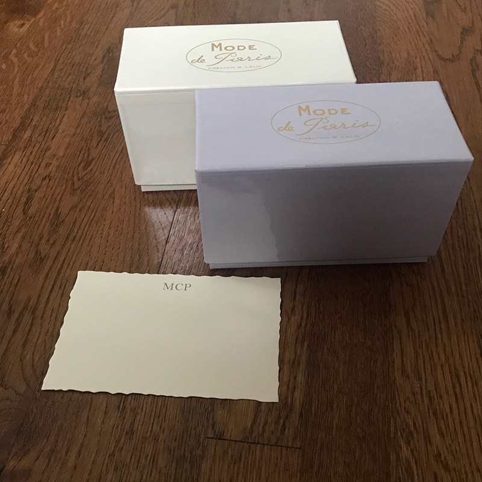

"My dad got me two boxes of nice stationery for Christmas a few years ago. The cards have deckled edges and soft colors; the cardstock is lightly ridged. They are a delight to handle. They have weight in my hands and look interesting and elegant.

I wasn’t sure, at first, what I would ever use them for: what did I need with nice stationery? But having beautiful notecards and envelopes sitting on my shelf has shifted my thinking and my behavior. I find myself handwriting thank-you notes and thinking-of-you notes to people more often, now. When it is easy and delightful to reach out to people and tell them I appreciate and love them: I do, and it brightens my day.

Of course, this was my dad's intention from the start. He writes notes to people all the time; he knows the power of stationery. His gift was not just paper but encouragement to reach out to others, and I thank him for it."

-- [Matisse](https://onwardlyfaring.neocities.org/)
