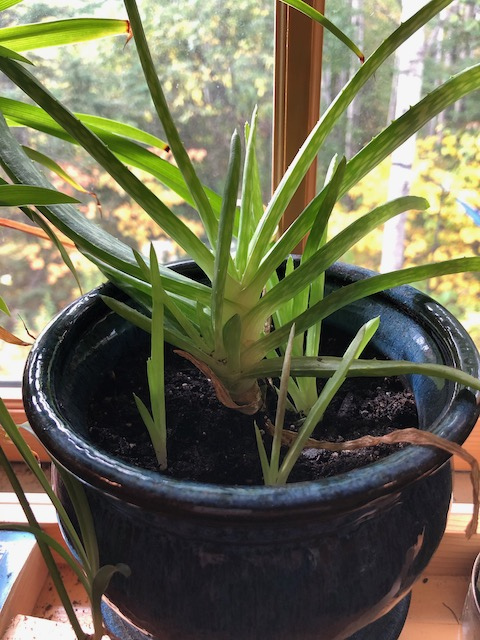

Aloe, of course. Another one from mom. I need to be careful not to overwater this one---the pot I have it in retains moisture *much* more than the terracotta pots I have most of my succulents in.

See the little babies in the front? I'm not sure how those guys started! They aren't attached to anything at all---you can just pick them right up.
