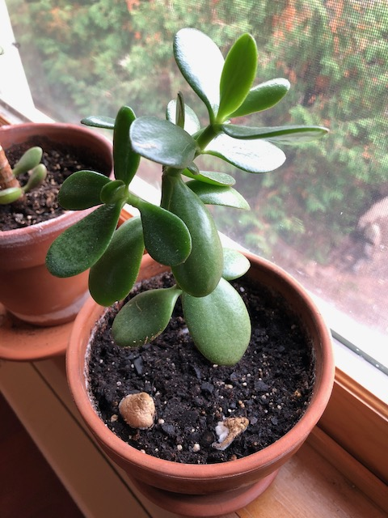

This one is from my sister. I'm not sure what this type of jade is actually called. The leaves are much bigger than my other jades.

And check out those bizarre fungi in the dirt! They're these yellow blobs that just erupted forth. They've been there for months through varying stages of growth, but they don't seem to be hurting the plant.
