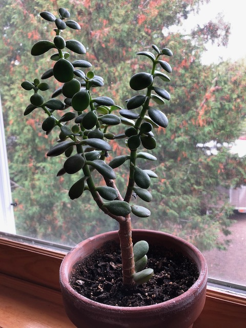

Another cutting from one of Dad's plants. This is my biggest jade, and had been doing wonderfully. He was developing that nice woody trunk, and had really nice big plump leaves at the bottom. However, I think I had him in a spot that wasn't sunny enough, and he seemed to stop growing and his biggest leaves dropped off. I have him in a sunnier window, and I think he's starting to do better again.
