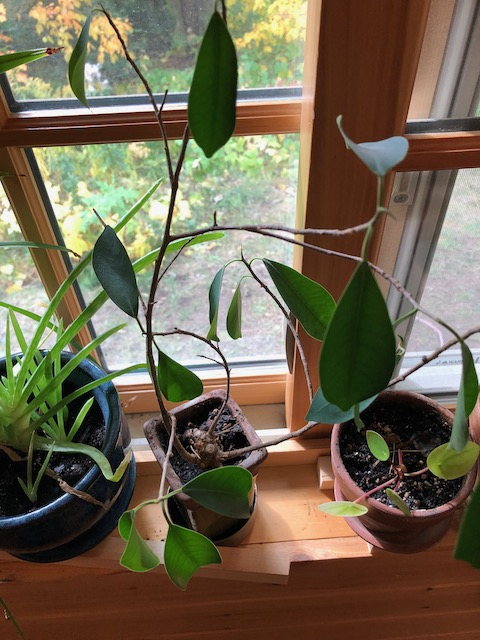
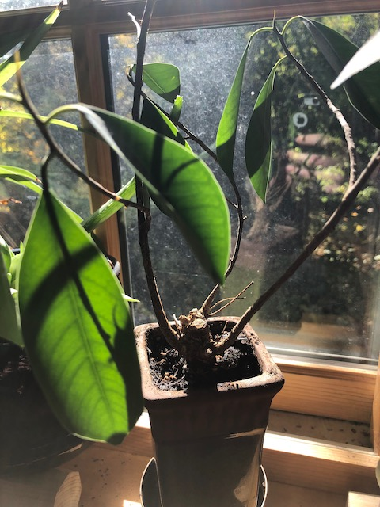

I don't know what this little tree is, but it's important to me---mom gave it to me as a graduation present in either 2008 or 2010. I'm calling it the Luck Tree because I think when I got it it has a little signpost in it that said "Good luck".

I tried to transplant it at one point, and discovered that the pebbles over the top of the dirt were glued in place. The pebbles are since gone, but I haven't tried again to transplant it. It seems happy.

I try to take good care of it, but there have been at least two occasions as it has moved from place-to-place when it was forgotten and neglected for weeks. It dried out and was very sad, but thankfully has recovered each time.

