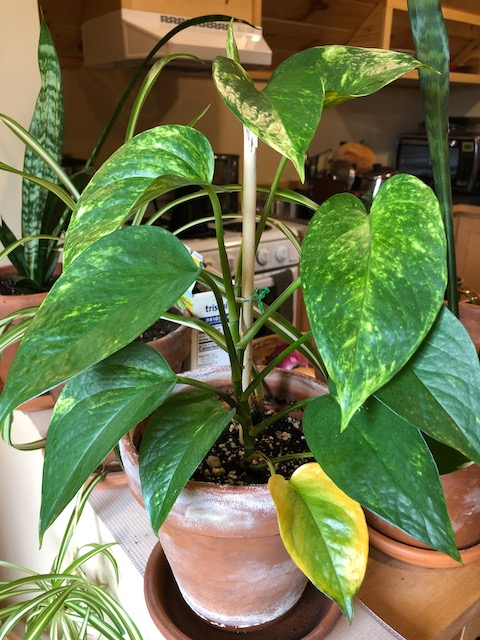

My pothos. Another plant from mom. I love this guy. He's so pretty.

These are sometimes mistakingly labeled as philodendrons, which they are not. Interestingly though, even the "correct" common name pothos is really a misnomer. When first described in 1880 it was named *Pothos aureus*. However, it later turned out that that classification was incorrect, and it's corrent name is *Epipremnum aureum*

They are also known by a whole mess of other names: golden pothos, Ceylon creeper, hunter's robe, ivy arum, money plant, silver vine, Solomon Islands ivy, marble queen, and taro vine, devil's vine and devil's ivy.
