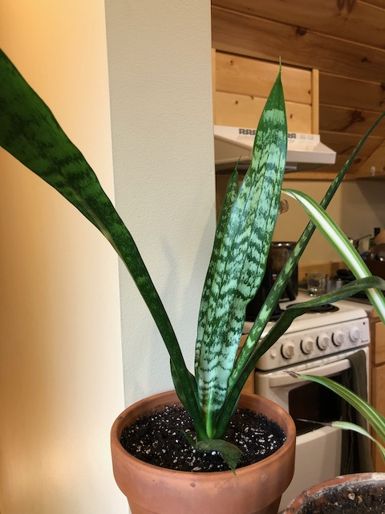

I haven't had snake plants for very long, but what I have learned is that they are *incredibly* resilient.

These two were originally the same plant, received from my mom. I had it sitting on a windowsill and while I was out of town for a while some friends stayed at my place. I don't know what happened, but when I got home the snake plant had been snapped off at its stem---the majority of the plant was lying on the floor.

I wasn't sure what else to do, so I just stuck the snapped off portion back in the pot, and to my surprise, *both* sections lived and continued to grow---the snapped off top put down new roots, and the existing roots shot up new leaves!

Once I realized what was happening, I seperated them into their own pots.

Additionally, one of them is starting a *new* shoot!

I'm not sure, but I suspect that when I seperated them I damaged the roots, so some isolated roots decided to start a new plant. Amazing.

Before I realized that they were going to survive, I got another one from mom---and proceeded to leave the cutting out on the counter for a week before finally planting it. By then it was pretty withered, and I didn't expect it to survive---but of course, it has.

