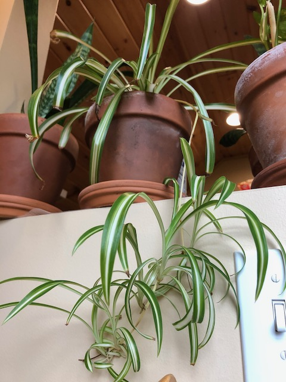
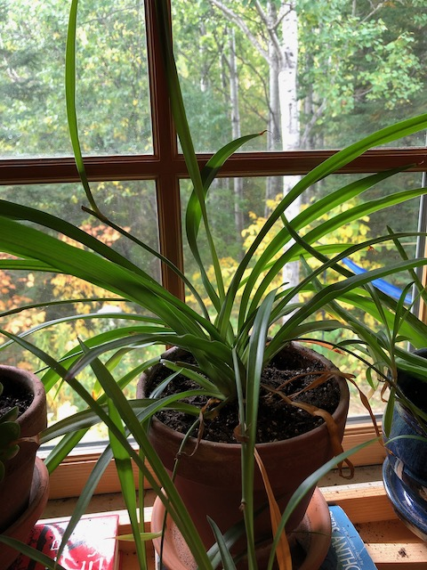

My spider plants. Our local post office apparently has a bunch of spider plants back in their work area, and at one point they put a bunch of cuttings out in the lobby for people to take. These both came from there and have flourished since.

I have found that they like to drink distilled water otherwise the ends of the leaves turn brown and die.
