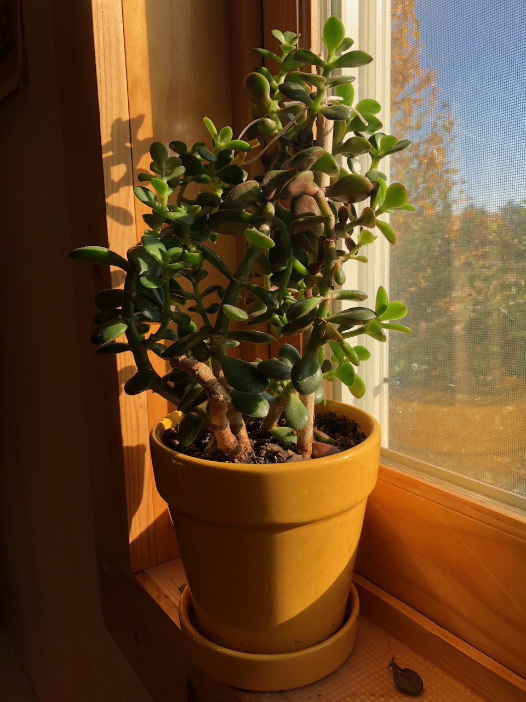

~~I think this is my oldest jade. It's from one of Dad's plants, and I think it's been in this yellow pot for around a decade.~~ ^[*Edit 10/16/20* This was all a case of mistaken identity---I forgotten that I had transplanted my old jade and put a different one in this yellow pot. It's been renamed accordingly.] It was really healthy, and then got [scale](https://www.epicgardening.com/scale-insects/) quite bad, which I think knocked it back a bit. It got really leggy and floppy. It's been scale-free for months now, and seems to be on the upswing.

I'm not planning on transplanting it any time soon---jades like to have their roots constrained. As long as I don't want it to get much bigger, I think it will be happy to continue living in this pot.

