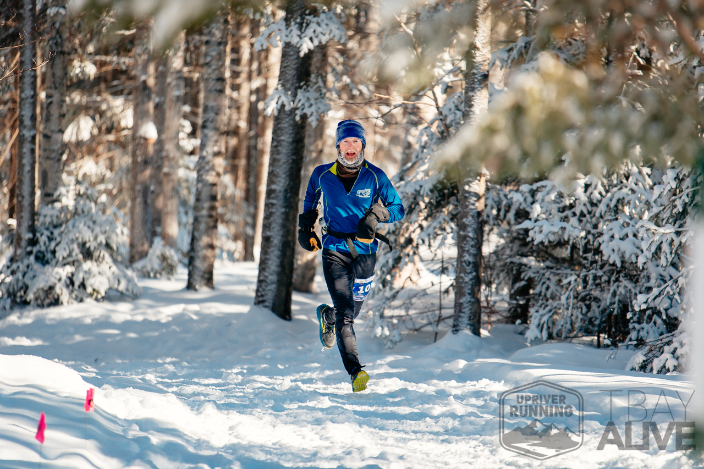

<h3>Table of Contents</h3>

[[toc]]

## TL;DR - Tentative race plan
- Blue Nose Half Marathon, Halifax N.S. -- May 20th, 2022
- High Noon 24 hour trail relay, Thunder Bay -- June 25th, 2022
- 50k fall trail race, Thunder Bay -- Oct 1, 2022

## 2022-03-22 - The first three months
I've never been much of a runner, despite Caroline's best efforts. When I've run with 4-10k distances with her I've struggled to keep up, and when I've run by myself I've always ended even short runs panting and exhausted, thinking I always had to run as fast as possible to make it count. The only race I'd run was a half-marathon trail relay at Kamview a few years ago (2017?) of which I ran 4.3 miles while Caroline did the remaining two thirds. I managed to match Caroline's pace and enjoyed the competition, but still felt destroyed by it.

My longest run to date was [16.4k](https://www.strava.com/activities/6724316888), which I ran on a whim last spring, and while I enjoyed it, again I was toast by the end and it put me off running again.

Something changed when I started running this winter after signing up for The Hoot Winter Trail Race Series with Caroline. I'm not sure if it was winter running, or running with Caroline and Madeline at a slower pace, but something finally taught me that it's okay to start slow. I also fell in love with winter running. The cold, the snow, the quiet, the lack of humidity. It's wonderful.

I also had to sign up for Strava as it was used by the race organizer to track the results, and I'm not going to lie---those Kudos have been a huge motivator for getting out there and running.

Me racing [The Hoot 5](https://www.strava.com/activities/6707030149/overview)

Although I found the races difficult---especially the Hoot 5, which with the deep snow and steep hills was grueling---something had shifted and I enjoyed the challenege more than before.

Around the same time, Caroline and I were deciding on our vacation plans, and Caroline mentioned there was a half-marathon in Halifax end of May. I've always wanted to visit Nova Scotia, Caroline wanted to visit family and friends there, and I had been bit by the running bug, so I said "Yes please!"

## Training for the Blue Nose half-marathon

A Strava subscription includes access to some basic running plans via McMillan[^1], so I just picked the [12-week half-marathon plan](https://site.finalsurge.com/TrainingPlans/McMillanPlanDetails?product=408414&distance=&timesec=&goaldistance=&goaltimesec=) there since it seemed convenient and I don't know enough to evaluate running plans.

### Week 1: March 14, 2022

Pretty easy week. I've been curious about training by heart zone, so I tried doing my [easy run](https://www.strava.com/activities/6830529247) in my Zone 2 heart rate range, but I fucked up the zones and ended up running way slower than I needed to.

Went *out* with Caroline basically for the first time since the pandemic started! We went to Sleeping Giant Brewing for some Irish music and a beer, and I ran my [cruise intervals](https://www.strava.com/activities/6840865301) on the way home. Running *from* somewhere *to* somewhere else rather than just a loop from home felt rewarding.

For my [long run](https://www.strava.com/activities/6854657352) I did 17.5k which is my longest distance ever, and I felt really good. No knee pain (until later in the day). I've been doing my physio diligently. Felt a lot better than I did on my [15k run](https://www.strava.com/activities/6742799944) a couple weeks prior.

### Week 2: March 21, 2022
Had some snow overnight, and my [easy run](https://www.strava.com/activities/6867365740) on Tuesday with Charlee was beautiful. Quiet night, no sound but the scuff of my feet in the snow and the jangle of Charlee's collar (and the asshole ripping by in his truck). Just did some loops of Chapples. It was my first time just running in circles and I kind of enjoyed it. Meditative.

I did loops of Chapples again for my [Tempo Intervals](https://www.strava.com/activities/6877517523) --- these speed workouts are starting to actually feel like workouts. Beautiful day, lots of other runners out.

We headed down to Duluth for the weekend to meet my new niece Juniper(!) and I got in a [short run](https://www.strava.com/activities/6885770345) with Biagio. I was really nice to just run with him and chat, and not gonna lie, also nice to run with someone slower. Went for a [longer run](https://www.strava.com/activities/6891966937) with Caroline the next day which was also really nice. She wasn't feeling great, but it was nice to be out in the sun with her.

### Week 3: March 28, 2022
[Tuesday called for a Progression Run](https://www.strava.com/activities/6903980502), and it kicked my butt! It wanted 60 minutes at an easy pace followed by 20 minutes at my half-marathon target pace of 4:30, and I pulled it off! Those 20 final minutes were the hardest I've ever pushed though. It's hugely beneficial seeing my pace in realtime on my wrist. I ended up with a distance of 17km, almost as long as my long run. I also ended up with a 22:43 5k in there, which is a PR!

Thursday was supposed to be a speed workout, but I was feeling really beat up from Tuesday. No knee pain, which is great, but now I'm having some new pain in my right Achilles (as well as an odd pain the top of my left foot). Anyway, I scrapped the speed workout and [ran easy for 8k](https://www.strava.com/activities/6913805704) instead. Hoping I can get my long run in still this week. Good thing next week is an easy week.

[^1]: Strava's integration (or lack-thereof) of these training plans is a little disappointing. I'd expect it to at least show today's workout in the app, and maybe even do fancier stuff like link the planned workout with its corresponding activity in Strava. Instead, you just get access to the training plan via strava.com only (and even then you can only see the coming two weeks in detail), and it emails you your next planned workout every day. It works, but it's clunky. I'd expect that they'll improve this in the future. 
