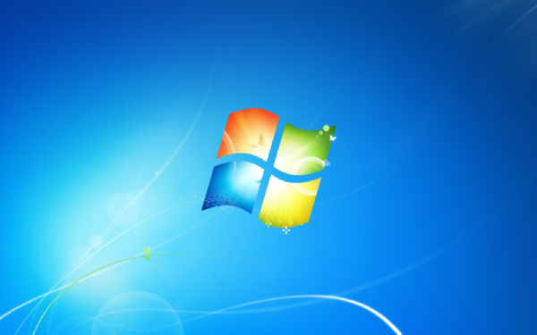

I love the default Windows 7 wallpaper (miles better than the depressing Windows 10 wallpaper, and rivaled only by XP's classic *Bliss*), but it's semi-difficult to find a high-res copy online.

So, for your pleasure, here it is: [Windows 7 default wallpaper](windows-7-default-wallpaper.png) (1920x1200).

## Upscaled versions
Bonus! Here are versions upscaled to higher resolutions (cribbed from [this reddit thread](https://www.reddit.com/r/windows/comments/8h9v95/does_anyone_have_the_original_windows_7_wallpaper/dyirxax/?utm_source=reddit&utm_medium=web2x&context=3)).

- [2304x1440](windows-7-default-wallpaper_2304x1440.png)
- [3456x2160](windows-7-default-wallpaper_3456x2160.png)
