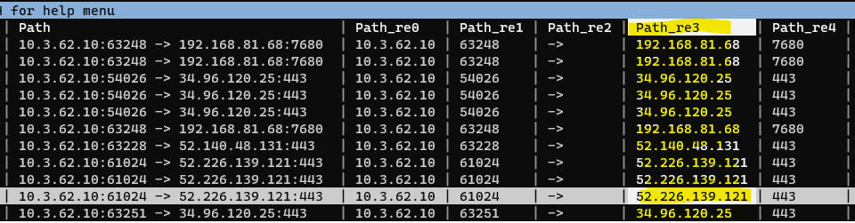
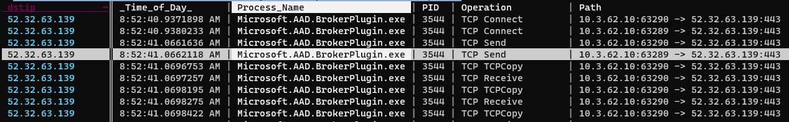

Given a destination IP address, can you find the name of the executable responsible for establishing that connection?

I had a scenario at work that involved the above. To provide context, when you authenticate to OneDrive using enterprise credentials, if your enterprise uses SSO OneDrive will open a small integrated browser window to display your organization's SSO and MFA pages---in our case, QuickLaunch and Duo. For reasons that are easier left unsaid, I needed to know the exact name of the executable responsible for making that network connection to our MFA provider---trial and error indicated that it's *not* OneDrive.exe.

I solved this with Process Monitor (ProcMon) and---my new favorite tool---VisiData.

The basic plan is:
1. Run a ProcMon capture while signing in to OneDrive.
1. Use VisiData to filter the ProcMon capture for only connections to the IP addresses belonging to our MFA provider.

First we'll start our ProcMon capture. 


We need to tell ProcMon *not* to resolve IP addresses to hostnames, since we're going to be comparing the output against Duo's IP addresses:


Once that's running, we'll sign in to OneDrive:


As mentioned, that will redirect to our SSO provider login form, opened inside an integrated browser window:


And then finally our MFA provider:


At this point, we know we've captured the network traffic to load the MFA login form, so we can go ahead and stop the capture.

Then we'll save the ProcMon capture as "Duo-ProcMon.csv" (not the default .pml), so that we can open it in VisiData.

The last thing we need is a list of Duo's IP addresses so we can pull that traffic out from our ProcMon capture.

We'll just copy that list from Duo's website. The only problem is that Duo provides them as a list of subnets, and we need the individual IP addresses, so we'll convert them in PowerShell.


First we'll paste it into Vim to clean it up a bit. We need to do two things in Vim: remove the leading whitespace from the beginning of each line, and surround each line in quotes.

<script id="asciicast-FNNOKZCyICDB1k1UsdROY845Z" src="https://asciinema.org/a/FNNOKZCyICDB1k1UsdROY845Z.js" async></script>

The substitute command we're using to accomplish that is `:%s/\v\s*(.*)/"\1"/`. Broken down:
- :%s
  - Begin the substution command (`s`) operating on the entire buffer (`%`)
- /
  - Begin the matching pattern
- \v
  - Enable "very magic mode" - makes it so special characters, such as "()" are treated as special by default. In other words, we don't need to escape them to make them special. Good idea to include this flag in any Vim RegEx, since this is how other RegEx implementations behave by defualt.
- \s*
  - Match any whitespace at the beginning of a line
- `(.*)`
  - Create a capture group to match the rest of the line
- /
  - Begin the substutition pattern
- "\1"
  - Insert the first capture group, surrouned by quotes.
- /
  - End the capture group

We're also using a very neat trick above to get the contents of the current Vim buffer back into the Windows clipboard (since we're running Vim in WSL):

`:w !clip.exe`

This "writes" the contents of the buffer (the same as saving a file), except it writes it to another command (clip.exe, which accesses the Windows clipbaord) rather than to a file.

Next we need to convert this list of subnets to a list of invidual IP addresses. First we'll just create a PowerShell array from the list of subnets. We'll do this by creating a new array with `$duoSubnets = @(`, and then simply pasting the list in from our clipboard, and ending it with a closing `)`:

```powershell
PS /home/justus> $duoSubnets = @(
>> "54.241.191.128/26"
>> "54.236.251.192/26"
>> "52.19.127.192/26"
>> "52.32.63.128/26"
>> "52.59.243.192/26"
>> "35.182.14.128/26"
>> "3.25.48.128/26"
>> "35.74.77.64/26"
>> "13.213.75.128/26"
>> "3.110.73.128/26"
>> "13.40.93.64/26"
>> )
```

Next we'll use a neat PowerShell module called "Intended.Net.IP" (available from the PowerShell Gallery) to convert the list of subnets to a list of individual IP addresses, and then save that list as a CSV. Specifically, the command we'll use for this is `Get-NetworkRange`:

```powershell
$duoSubnets | Get-NetworkRange | select IPAddressToString | export-csv -NoTypeInformation DuoIPs.csv
```

Here's an asciicast of the whole process:

<script id="asciicast-1UoFArtuJ76ph61cr7pTcSlxY" src="https://asciinema.org/a/1UoFArtuJ76ph61cr7pTcSlxY.js" async></script>

Okay, now we've finally got our two CSVs: the ProcMon capture, and Duo's IP addresses. Now the fun part: VisiData.

First we'll open the ProcMon capture in VisiData: `visidata ./Duo-ProcMon.csv`:


ProcMon captures a *lot* of stuff. We only care about network connections, so we're going to make things easier on ourselves by displaying only those rows. Navigate to the **Operation** column, press `|` (select by RegEx), and at the prompt enter "TCP". Probably nothing will have changed on your screen, but the lower-right corner of VisiData will show that we've selected a very small subset of our rows---in this case, 961 rows selected out of 309,730 total:


If you were to scroll down, you would also begin to see some selected rows highlighted in orange:


Now we'll press `"` to create a new sheet containing *only* the selected rows. And again, we'll rename this sheet using `<space>rename-sheet` to "procmon-TCP connections":


If we move over to the **Path** column and expand it using `_`, and we'll see the destination IP addresses, amongst some other info:


We need to get the destination IPs in their own column, so to do this we'll split the **Path** column using `:`. When prompted for the RegEx to split on, enter "[ :]". This will split on *either* a colon or a space, which is what we want since the IP address has a space before it and a colon after.

This will create a few new columns since there are multiple spaces and colons in the **Path** column, but the new column containing the destinion IP is the only one we care about:



We'll rename this column to "dstip" using `^`, change the type of column to text by pressing `~`, and turn it into a "key" it with `!`. Once we've made it a key column, it will jump over to the left of our sheet and turn purple---this is what allows us to join it with our list of Duo IPs.


Next we'll open our list of Duo IP addresses as a separate sheet using `o DuoIPs.csv`:


Rename the column to "dstip" so that it matches the key column name in the ProcMon sheet with `^dstip<enter>`, change the column type to text with `~`, and then designate it as a key column with `!`:


*Notice the little squigly to the right of the column name indicating that it's a text column*

Now we'll go to our Sheets sheet with `Shift-S` which shows all our open sheets. Then we'll select both our "DuoIPs" sheet and our "procmon TCP connections" sheet by highlighting them and then pressing either `s` (select) or `t` (toggle). They'll turn orange when they're selected:


Once we have them both selected, we'll join them by pressing `&`. When prompted for the join type, we'll use "inner", because we want to select only rows where the key column ("dstip") matches in both sheets:


In the resulting joined sheet we finally see that the executable name responsbile for the Duo connections is "Microsoft.AAD.BrokerPlugin.exe":



We can quickly confirm that this is the *only* executable name that appears by selecting the **Process Name** column and creating a frequency sheet with `Shift-F`:

And indeed it is:


Here's the asciicast of the whole VisiData process:

<script id="asciicast-jKcNcjSNZduOyBxP8fZRyXOmC" src="https://asciinema.org/a/jKcNcjSNZduOyBxP8fZRyXOmC.js" async></script>
