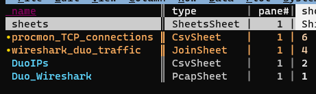

Given a destination IP address, can you find the name of the executable responsible for establishing that connection?

I had a scenario at work that involved the above. To provide context, when you authenticate to OneDrive using enterprise credentials, if your enterprise uses SSO OneDrive will open a small integrated browser window to display your organization's SSO and MFA pages---in our case, QuickLaunch and Duo. For reasons that are easier left unsaid, I needed to know the exact name of the executable responsible for making that network connection to our MFA provider---trial and error indicated that it's *not* OneDrive.exe.

Although I'm sure there are numerous (and possibly easier) ways to solve this, I chose to use ProcMon, Wireshark, and---my new favorite tool---VisiData.

The basic plan is:
1. Run Wireshark and ProcMon captures simutaneously while signing in to OneDrive.
1. Filter the Wireshark capture for connections to the IP addresses of our MFA provider.
1. Find the executable name by cross-referencing the Wireshark capture with the ProcMon capture based on the source port of the connection.

First we'll start our Wireshark and ProcMon captures. We're specifying a simple Wireshark display filter of "ip.proto == TCP" for two reasons: 1) It will reduce the size of our .pcap, but more importantly, 2) If we don't exclude DNS traffic from the export, the exported .pcap will contain hostnames rather than IP addresses, which we don't want. (The other way to avoid this is Edit -> Preferences -> Name Resolution -> uncheck "Use captured DNS packet data for address resolution".


Once those are running, we'll sign in to OneDrive:


As mentioned, that will redirect to our SSO provider login form, opened inside an integrated browser window:


And then finally our MFA provider:


At this point, we know we've captured the network traffic to load the MFA login form, so we can go ahead and stop both captures.

We'll save the Wireshark capture as "Duo-Wireshark.pcap", using File -> Export Speficified Packets, choosing to export only the Displayed packets and also making sure to save it as a .pcap file (not the default .pcapng) so that we can open it in VisiData:


Then we'll save the ProcMon capture as "Duo-ProcMon.csv" (not the default .pml), again so that we can open it in VisiData.

Now we have two of our pieces of data. The last thing we need is a list of Duo's IP addresses so we can pull that traffic out from our Wireshark capture.

We'll just copy that list from Duo's website. The only problem is that Duo provides them as a list of subnets, and we need the individual IP addresses, so we'll convert them in PowerShell.


First we'll paste it into Vim to clean it up a bit. We need to do two things in Vim: remove the leading whitespace from the beginning of each line, and surround each line in quotes.

<script id="asciicast-FNNOKZCyICDB1k1UsdROY845Z" src="https://asciinema.org/a/FNNOKZCyICDB1k1UsdROY845Z.js" async></script>

The substitute command we're using to accomplish that is `:%s/\v\s*(.*)/"\1"/`. Broken down:
- :%s
  - Begin the substution command (`s`) operating on the entire buffer (`%`)
- /
  - Begin the matching pattern
- \v
  - Enable "very magic mode" - makes it so special characters, such as "()" are treated as special by default. In other words, we don't need to escape them to make them special. Good idea to include this flag in any Vim RegEx, since this is how other RegEx implementations behave by defualt.
- \s*
  - Match any whitespace at the beginning of a line
- `(.*)`
  - Create a capture group to match the rest of the line
- /
  - Begin the substutition pattern
- "\1"
  - Insert the first capture group, surrouned by quotes.
- /
  - End the capture group

We're also using a very neat trick above to get the contents of the current Vim buffer back into the Windows clipboard (since we're running Vim in WSL):

`:w !clip.exe`

This "writes" the contents of the buffer (the same as saving a file), except it writes it to another command (clip.exe, which accesses the Windows clipbaord) rather than to a file.

Next we need to convert this list of subnets to a list of invidual IP addresses. First we'll just create a PowerShell array from the list of subnets. We'll do this by creating a new array with `$duoSubnets = @(`, and then simply pasting the list in from our clipboard, and ending it with a closing `)`:

```powershell
PS /home/justus> $duoSubnets = @(
>> "54.241.191.128/26"
>> "54.236.251.192/26"
>> "52.19.127.192/26"
>> "52.32.63.128/26"
>> "52.59.243.192/26"
>> "35.182.14.128/26"
>> "3.25.48.128/26"
>> "35.74.77.64/26"
>> "13.213.75.128/26"
>> "3.110.73.128/26"
>> "13.40.93.64/26"
>> )
```

Next we'll use a neat PowerShell module called "Intended.Net.IP" (available from the PowerShell Gallery) to convert the list of subnets to a list of individual IP addresses, and then save that list as a CSV. Specifically, the command we'll use for this is `Get-NetworkRange`:

```powershell
$duoSubnets | Get-NetworkRange | select IPAddressToString | export-csv -NoTypeInformation DuoIPs.csv
```

Here's an asciicast of the whole process:

<script id="asciicast-1UoFArtuJ76ph61cr7pTcSlxY" src="https://asciinema.org/a/1UoFArtuJ76ph61cr7pTcSlxY.js" async></script>

Okay, now we've finally got our three CSVs: Wireshark and ProcMon captures, and Duo IP addresses. Now the fun part: VisiData.

First we'll open "Duo-Wireshark.pcap" in VisiData: `visidata .\Duo-Wireshark.pcap`:


Then we'll move over to the *dsthost* column and mark it as a key column with `!`:


Next we'll open our list of Duo IP addresses as a separate sheet using `o DuoIPs.csv`:


Rename the column to "dsthost" so that it matches the key column name in the Wireshark sheet with `^dsthost<enter>`, change the column type to text with `~`, and then designate it as a key column with `!`:


*Notice the little squigly to the right of the column name indicating that it's a text column*

Now that we have two sheets, both containing a key column of the same type, we'll perform an "inner join" on these two sheets in order to filter the Wireshark sheet to only packets sent to a Duo IP address. Go to the "sheets sheet" with `Shift-S`. This displays all the sheets we currently have open in VisiData:


Select both the "DuoIPs" sheet and the "Duo_Wireshark" sheet with `t` (toggle) or `s` (select):


Join them with `&`, and at the prompt, choose "inner":


Success! We're now looking at a sheet containing only packets destined for Duo IP addresses:


It's really easy to get lost once we have a bunch of sheets open in VisiData, so we're going to go ahead and rename this new sheet to "wireshark-duo traffic" by pressing `<space>` to raise the VisiData command prompt, and then entering `rename-sheet<enter>`, and at the prompt, type "wireshark-duo traffic".

Next we're going to join this new sheet with our ProcMon sheet on the srcport column to find the executable responsible for making these connections. First we'll "un-key" the dsthost column with `!`, and then key the **srcport** column:


Now we'll open our ProcMon capture with `o Duo-ProcMon.csv`:


ProcMon captures a *lot* of stuff. We only care about network connections, so we're going to make things easier on ourselves by displaying only those rows. Navigate to the **Operation** column, press `|` (select by RegEx), and at the prompt enter "TCP". Probably nothing will have changed on your screen, but the lower-right corner of VisiData will show that we've selected a very small subset of our rows---in this case, 961 rows selected out of 309,730 total:


If you were to scroll down, you would also begin to see some selected rows highlighted in orange:


Now we'll press `"` to create a new sheet containing *only* the selected rows. And again, we'll rename this sheet using `<space>rename-sheet` to "procmon-TCP connections":


If we move over to the **Path** column and expand it using `_`, and we'll see the source ports information:


(We'll also see that ProcMon displays hostnames rather than IP addresses when the process accessing the resource using the hostname, which is why we needed the Wireshark capture as well).

We need to get the source ports in their own column, so to do this we'll split the **Path** column using `:`. When prompted for the RegEx to split on, enter "[ :]". This will split on *either* a colon or a space, which is what we want since the source port has a colon before it and a space after.

This will create a few new columns since there are multiple spaces and colons in the **Path** column, but the new column containing the source port is the only one we care about:


We'll rename this column to "srcport" using `^`, change it to an integer type using `#`, and key it with `!`:


Now we'll return to our Sheets sheet (`Shift-S`), unselect our previously selected sheets using `t` (toggle) or `u` (unselect), and then select our new "procmon TCP connections" and "wireshark duo traffic" sheets using `t` (toggle) or `s` (select):



Now we'll again join these two sheets with an inner join: `&`, and in the resulting joined sheet we finally see that the executable name responsbile for the Duo connections is "Microsoft.AAD.BrokerPlugin.exe":


We can quickly confirm that this is the *only* executable name that appears by selecting the **Process Name** column and creating a frequency sheet with `Shift-F`:

And indeed it is:


