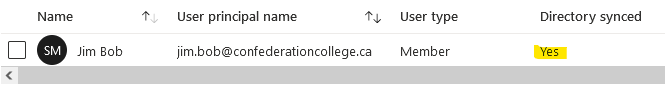

## The Issue
If you have a hybrid Exchange/O365 environment, and you create an Office365 mailbox without first creating an on-prem Active Directory account, the mailbox will not be able to receive mail from external or on-prem senders (although it will be able to receive mail from other O365 mailboxes!).

This is because all inbound mail goes to the on-prem Exchange server first, and then if the user is on O365 the Exchange server forwards the mail on to O365. If a local AD account doesn't exist for the O365 mailbox, then the Exchange server has no way of knowing about the O365 mailbox and will reject the message.

Additionally, if you search for the user in the Azure AD portal, you will see that the user is **not** directory synced:


## The Resolution
1. Create an on-prem AD user with the same User Principal Name as the Azure user.
2. Run the following command in the on-prem Exchange Management Shell to link the new AD user to the existing O365 mailbox:
```powershell
# Replace the mailbox name and tenant domain with your own
Enable-RemoteMailbox "jim.bob" -RemoteRoutingAddress "jim.bob@contoso.mail.onmicrosoft.com"
```
3. **IF** the O365 mailbox is a shared mailbox and not a regular user, also do the following two steps. Otherwise, the O365 mailbox will be converted to a regular mailbox (and will need to be licensed):
  1. `set-aduser smsace -Replace @{msExchRemoteRecipientType=100;msExchRecipientTypeDetails=34359738368}`
  2. Disable the local AD account (optional, but typically shared mailboxes are attached to a disabled AD account).
4. Finally, trigger an AD Connect sync or wait for one to occur. If you search for the user again in Azure AD, it should now say "Directory synced: Yes":


Good to go!
