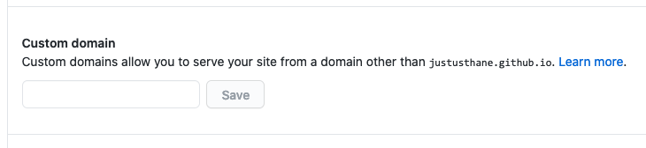

[[toc]]

# Intro & Prereqs

Github Pages is an excellent way to host a site built with the [Eleventy](https://11ty.dev) static-site generator&mdash;with just a little bit of work, you can have free hosting with a custom domain that automatically rebuilds your site with every `git push`.

This guide is adapted from [this excellent guide](https://dev.to/sophiabrandt/how-to-deploy-eleventy-to-github-pages-with-github-actions-0) by [Sophia Brandt](https://www.sophiabrandt.com) with some additions.

This guide assumes the following prerequisites:
- You already own a domain.
- You already have a site built in Eleventy. If not, follow the [Getting Started](https://www.11ty.dev/docs/getting-started/) guide at the Eleventy website.
- You have a basic understanding of how to use Git and Github. If not, learn it! It's probably not as hard as you expect, and it's well worth your time. [Here's a beginner's tutorial](https://towardsdatascience.com/getting-started-with-git-and-github-6fcd0f2d4ac6?gi=fd38779a1e37).
- You have git installed on your computer and have a local git repo set up for your Eleventy site.
- You have a basic understanding of how to create DNS records.

## Hosting an Eleventy site on Github Pages *without* a custom domain

Although this guide assumes you want to use a custom domain, you can also certainly host an Eleventy site on Github Pages without one, using `<your-github-username>.github.io` instead. If that's the case, ignore the "Set up your DNS records" section and everything after.

# Instructions

## Get Eleventy ready for Github Pages

First, edit the `package.json` file in your Eleventy folder to include **build** and **serve** scripts by adding the highlighed lines as follows:

``` json/7-8
{
  "name": "11ty-justus.ws",
  "version": "1.0.0",
  "description": "",
  "main": "index.js",
  "scripts": {
    "test": "echo \"Error: no test specified\" && exit 1",
    "serve": "eleventy --serve",
    "build": "eleventy"
  },
...
}
```

Currently you probably build and serve Eleventy locally with the command `eleventy --serve`. The above allows you to do the same thing by using the command `npm run serve` (or `npm run build` to build the site without starting the webserver). You don't need to use these commands if you don't want to, but they are required by the Github Action.

## Create your Github Repo

Create a new repo on Github. The repo **must** be named "&lt;github-username&gt;.github.io". For example, if your Github username is "janedoe", your repo needs to be named "janedoe.github.io".

If you already have an existing Github repo that you're using with your Eleventy site, you can either rename it or create a new repo. We'll be pushing your local repo up to it, so your commit history will be retained.

Once you have your repo set up on Github, add it as the origin to your local repo:

``` bash
# git remote add github <url-of-your-github-repo>
# git push -u github master
```
**Note:** The `-u` flag sets Github as the default upstream origin for this branch, so from now on you can just run `git push` to push to Github.

## Set up the Github Action

Create the file `.github/workflows/build.yml` in the root of your Eleventy site (you'll have to create the `.github` and `workflows` directories) with the following contents:

``` yaml

name: Build Eleventy

on:
  push:
    branches:
      - master

jobs:
  build:
    runs-on: ubuntu-20.04

    strategy:
      matrix:
        node-version: [12.x]

    steps:
      - uses: actions/checkout@v2

      - name: Use Node.js ${{ matrix.node-version }}
        uses: actions/setup-node@v1
        with:
          node-version: ${{ matrix.node-version }}

      - name: Install dependencies & build
        run: |
          npm ci
          npm run build

      - name: Deploy
        uses: peaceiris/actions-gh-pages@v3
        with:
          publish_dir: ./_site
          github_token: ${{ secrets.GITHUB_TOKEN }}

```
This Action calls on [this third-party action](https://github.com/peaceiris/actions-gh-pages) by [Peace Iris](https://peaceiris.com/) to actually do the deploy. Luckily we don't need to understand exactly how it works, but basically it copies the static files from the `_site` directory where Eleventy outputs them to a new `gh-pages` branch where Github will serve them from.

Save it, commit it, and push it to Github:
``` shell
# git add .
# git commit -m 'Added Github Actions build file`
# git push
```

Now to get Github to build your site, make a change to any file, and again save it, commit it, and push it.

**If you aren't using a custom domain, you're done! Your site should be accessible now at `<github-username>.github.io`. Otherwise, read on!**

## Set up your DNS records

Create a CNAME record for `www.your-domain.com` pointing to `<your-github-username>.github.io`, and a CNAME, ANAME, or ALIAS (whatever your provider supports) at the root of your domain pointing to `<your-github-username>.github.io`.

If your DNS provider doesn't support any of these alias records at the root of your domain you can also use A records pointing at Github's UP addresses [as indicated here](https://docs.github.com/en/github/working-with-github-pages/managing-a-custom-domain-for-your-github-pages-site#configuring-an-apex-domain), but it's better to use an alias if possible.

## Configure your custom domain

Open the **Settings** page for your repo on the Github website, and scroll down to the **Github Pages** section. Under **Source**, change the branch to `gh-pages`. Leave the folder set to `/ (root)`.

Set the **Custom Domain** to `www.your-domain.com` and save it.

## Done...almost

If everything went correctly, your site should now be visible online. However, next time you push your site, you'll notice that it has disappeared from the internet! When you visit `www.your-domain.com`, you'll see the following error:


Well that's not good. If you go back to the Settings page for your Github repo, you'll see that your custom domain info has been removed!



If you enter it back in, it will work again---until the next time you push your site. Obviously we don't want to have to re-enter our domain every time we push our site!

It turns out the issue is that Github stores your domain info in a CNAME file in the root of the `gh-pages` branch, but every time we build our site, Eleventy deletes the file and thus our custom domain setting is lost.

## Adding a CNAME file

The solution is to create a file called `CNAME` in the root of your Eleventy site with a single line containing your custom domain:
``` yaml
www.your-domain.com
```

Now we need to tell Eleventy to copy that file when building your site, because by default, it won't.

Edit your `.eleventy.js` file and add the highlighted line:
``` js/2
module.exports = function(eleventyConfig) {
  ...
  eleventyConfig.addPassthroughCopy("CNAME");
  ...
}
```
(For more information on Passthrough File Copy, see the Eleventy [documentation](https://www.11ty.dev/docs/copy/).

Save it, commit it, push it, and your site should be back. Yay!

# Comments

Comments? Questions? Was this helpful? [Email me](mailto:jg@justus.ws)!
