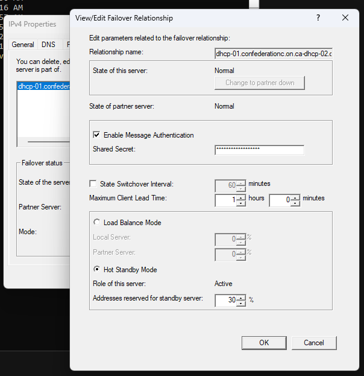

We had a pair of Windows Server 2012 R2 DHCP servers (one active, one hot standby) with 117 scopes and 3,400 active leases. I recently completed the migration off of these servers onto new Server 2025 servers.

The process was very easy, and I was able to complete it during business hours with no noticeable impact. Here are the steps I took:

1. Provision new servers with new IP addresses and install DHCP role.
2. Migrate the configuration from the old *primary* server to the new *primary* server:
    1. Run `Export-DhcpServer -File <path>` on the old server, copy the resulting file to the new server, and run `Import-DhcpServer -File <path>` on the new server.
    - *Note*: After doing this, all scopes will be active on both the old and new DHCP servers. In my case, the DHCP servers don't have a scope for the subnet on which they reside - all subnets have a DHCP helper at the gateway pointing at the IP addresses of the current DHCP servers - so even though the scopes are active on the new server, no leasues will be issued by the new servers. If you do have a DHCP scope on the same subnet on which the DHCP servers reside, you will want to deactivate that scope on the new server before proceeding.
2. Authorize the new DHCP servers in Active Directory, either with the `Add-DhcpServerInDC` PowerShell command (run on each new server), or via the DHCP management console (Right-click the DHCP server node -> Authorize).
3. Create a new failover relationship between the two new servers, using the same settings as the failover relationship between the old servers.
    1. In the DHCP management console, expand the node of the current primary DHCP server, right-click the IPv4 node, and open the Properties. Click on the Failover tab, and then select the failover relationship and click Edit. Make note of the settings.
    
