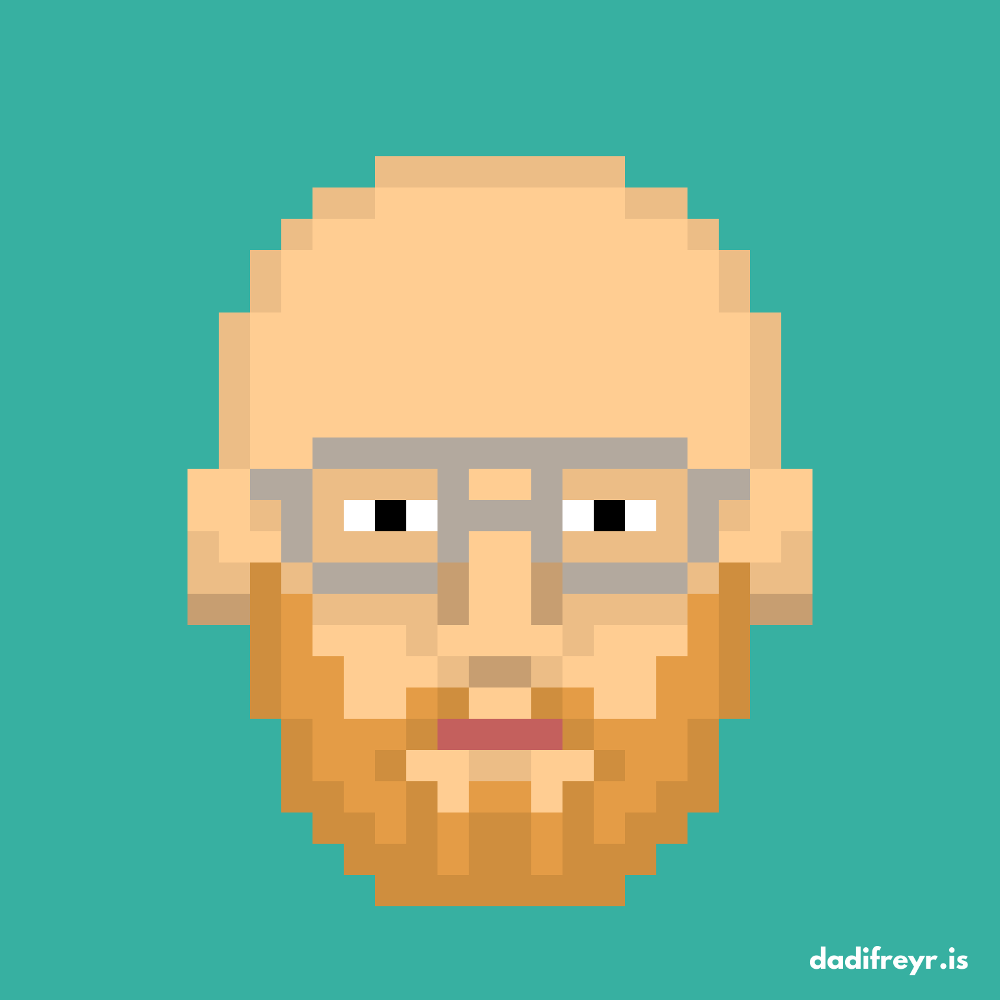
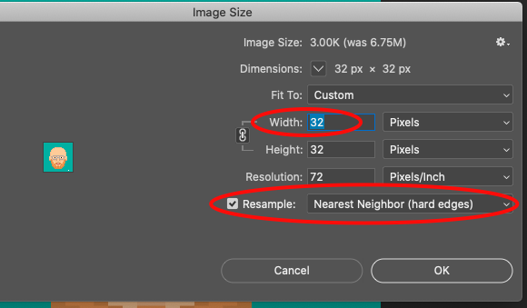
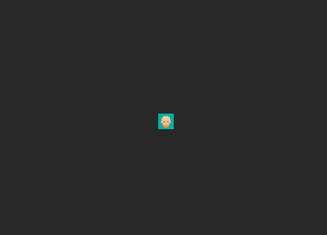
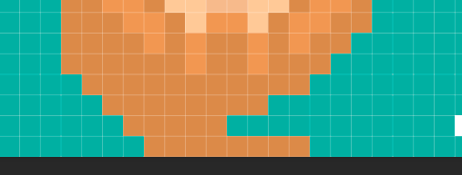
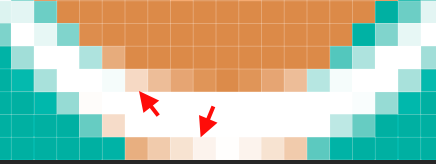
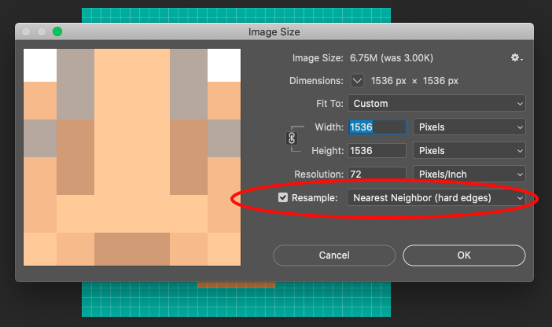

Editing pixel art in Photoshop isn't entirely straight forward, but easy enough with a few simple instructions.

# TL;DR

This whole pointlessly long page can be boiled down to the following:

1. Figure out how many pixels wide your pixel art is "supposed" to be. One way to do this is to divide the width of the image (in actual pixels) by the width of one of the "pixel art pixels".
2. Resize the image to that size, using the "Nearest Neighbor" resampling mode.
3. Make your edits using a 1px Pencil brush.
4. If you need to make any selections, make sure to set Feather to 0px and disable anti-aliasing.
5. Scale the image back up to whatever size you want, again using the "Nearest Neighbor" resampling mode.

For more, read on!

# Intro

I created this self-portrait using the fun pixel art avatar generator on the website of the Icelandic band [Daði Freyr](https://dadifreyr.com/), but it's not *quite* right. My beard is longer, my glasses aren't aviators, my eyes are blue, not black,  and my forehead *simply isn't that bulbous*. Hmph. Well, should be easy enough to fix in Photoshop, right? I immediately discovered that it wasn't *quite* as trivial as I had hoped.

While it's ostensibly pixel art, it's been enlarged so that each original pixel is, in reality, hundreds of pixels. I'll call these super big pixels "faux-pixels" from now on. Or better yet, how about...*fauxels*. The issue is keeping our edits on the existing "grid" that these *fauxels* lie on.

For example, I want to lengthen my beard. To draw the new *fauxels*, I'd need to create a square brush in Photoshop exactly the size of the existing *fauxels*, and even then, I'd have to very carefully align each stroke with the existing *fauxel* grid.

# The Instructions

Luckily, there's a better way to do this, and it involves returning our art to it's "original" size where each *fauxel* is actually a single pixel.

First figure out how many *fauxels* wide your art is. To do this, measure one of them. Zoom in until you can see the pixel grid (to make sure we get our measurement perfect), and measure the width of one *fauxels* using the Ruler tool (I):

In this case, each *fauxel* is 48 actual pixels across. Now you need the actual width of your art. Find it by opening the *Image Size* window (Image menu -> Image Size).

1536 pixels. Now to figure out how many *fauxels* wide your art is, divide the actual width of the image by the width of a *fauxel*. In this case, 1536/48 = 32, so this art is 32 *fauxels* across.

Now that we know that, return to the Image Size window and resize your artwork to its proper pixel-perfect size&mdash;in this example, 32 pixels wide. There's one other *very important* thing you have to do here: change the resampling mode to "Nearest Neighbor"&mdash;this will make sure Photoshop leaves your *fauxels* intact and doesn't try to do any aliasing or blending or other fancy things with them.

It's tiny! Zoom way in...

And now you're no longer working in *fauxels*, but our good and proper pixels! What a relief, that was a dumb word anyway.

Now simply use the Pencil tool (B), set to a 1px brush size, to make whatever changes you want. The Eyedropper tool (I) is also a good friend of ours to match the existing colors.

I don't have any suggestions for the editing itself, it turns out pixel art is *hard*.

You can also use the Selection and Move tools to select things and move them around. I'm going to move the head higher to give me more room for a glorious beard.

Just make sure to set Feather to 0px and uncheck Anti-alias *before* making the selection...

...otherwise you'll end up with "transparent" pixels like this along the edges:

***...Jump cut...***

Much better.

Once you've made all your desired changes, the only thing left to do is scale back up! 

Again use the Image Size window, and again make sure to select the Nearest Neighbor resample mode, and return your art to its original size&mdash;or whatever size you want! Since there will be no loss of quality scaling up, the sky is the limit!

Save, and you're done!

What a handsome devil.

# Comments

Have a better method? <a href="mailto:jg@justus.ws">Email me</a>!
