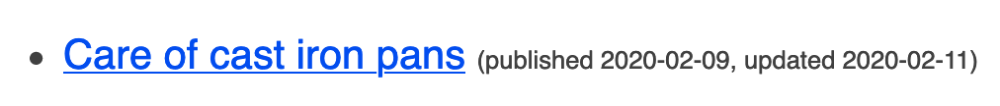

When using the Eleventy static site generator, if you specify a date in frontmatter and then display the date in a template, the displayed date might be off by a day. This happens because Eleventy assumes dates are in UTC, but the templating languages (Liquid, etc) display the date in your local timezone. In fact, the Eleventy docs even list this as a [Common Pitfall](https://www.11ty.dev/docs/dates/#dates-off-by-one-day).

Frontmatter:
```
---
title: Care of cast iron pans
date: '2020-02-10'
updated: '2020-02-11'
---
```

Template:
```
{{ page.date | date: '%Y-%m-%d' }}
```

Result:

:/

The docs suggest resolve this by creating a Liquid filter to call the JavaScript `toUTCString()` function.
