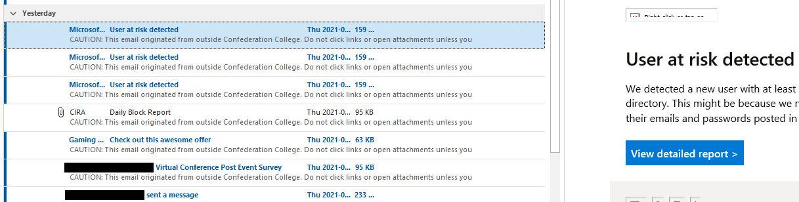
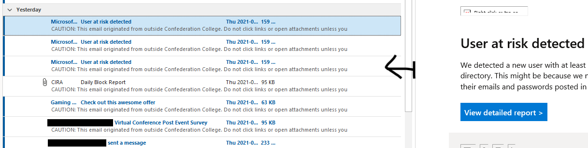
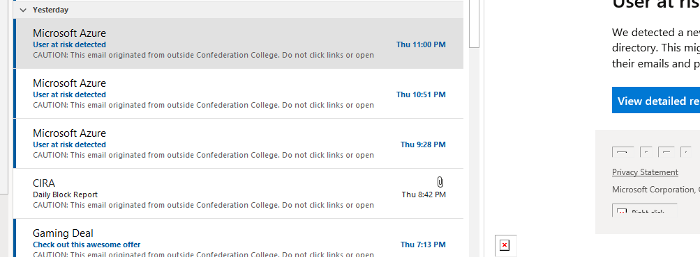
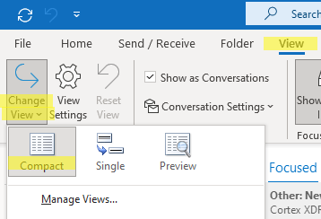

Have you ever fired up Outlook in the morning to find that your Outlook inbox is just...weird? You know it's wrong, but you can't for the life of you remember what it's *supposed* to look like, or figure out how to fix it?

*Wtf is wrong with this? Gross.*

Okay, maybe that's me, but in case this has happened to you, here's the (ridiculously simple) fix that will make you feel like an idiot. Or at least made me feel like an idiot.

Just grab the divider bar of the preview pane and drag it back towards the left (if you don't have the preview pane enabled, make sure you enable it and set it to "Left"):

*Ahhhhhh.....clean and comfy.*

### If that doesn't fix it...

Make sure your View is set to Compact:

And reset the view:

