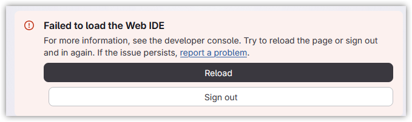
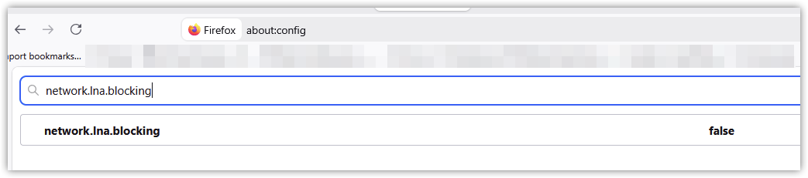
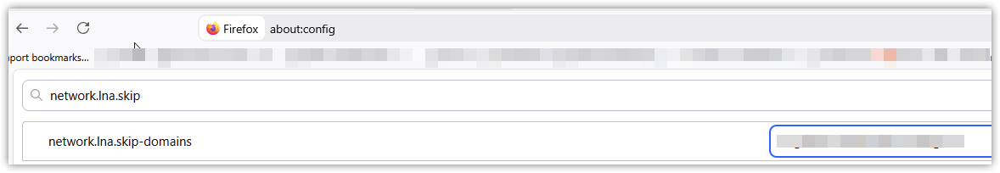
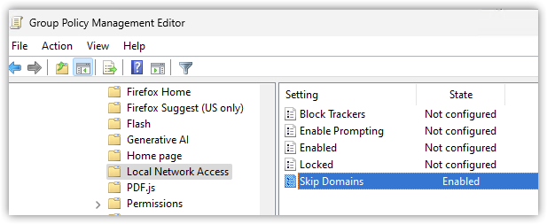

If you self-hosted Gitlab using a private IP address, using Firefox 153 or newer, the web IDE fails to load:

DevTools shows the following errors:

> Cross-Origin Request Blocked: The Same Origin Policy disallows reading the remote resource at `https://<internal Gitlab host>/api/graphql`. (Reason: CORS request did not succeed). Status code: (null). 2

> [gitlab] Failed to load Web IDE
 Error: The Web IDE could not load because the extension host domain is unreachable.
    u get_web_ide_workbench_config.js:146
    x init_gitlab_web_ide.js:44
    abRe index.js:27
    abRe index.js:3
    Webpack 6
index.js:5:11

In the network requests, you'll see a blocked request to `<internal Gitlab host>/api/graphql` with an origin similar to `https://workbench-2432e4c3da32cb6e6c581678692f92.cdn.web-ide.gitlab-static.net`.

This happens because beginning with version 153, Firefox blocks public websites from accessing local resources. Because the workbench script is located at `cdn.web-ide.gitlab-static.net`, and it's telling your browser to make a request to `https://<internal Gitlab host>/api/graphql`, which resolves to a private IP address, that request is blocked by Firefox.

Normally this would trigger Firefox to prompt you to allow or block local network access, but because the web IDE is loaded in an iframe, it does not.

You can quickly confirm that this is the issue by opening the `about:config` page in Firefox and setting `network.lna.blocking` to **false**:

# Solutions

In addition to the quick workaround above, there are a couple permanent solutions.
## Exempt your internal Gitlab host from local network blocking

Open the `about:config` page in Firefox, and add the internal FQDN of your Gitlab server to the `network.lna.skip-domains` setting:

This can also be managed via Group Policy, using the "Local Network Access" policies in the Firefox Administrative Template: https://firefox-admin-docs.mozilla.org/reference/policies/localnetworkaccess/:

## Configure a custom extension host domain
Rather than running the Web IDE from the default Gitlab domain (*.cdn.web-ide.gitlab-static.net), you can configure it to run from your local Gitalb server: https://docs.gitlab.com/administration/settings/web_ide/