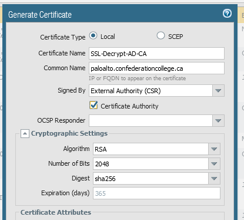
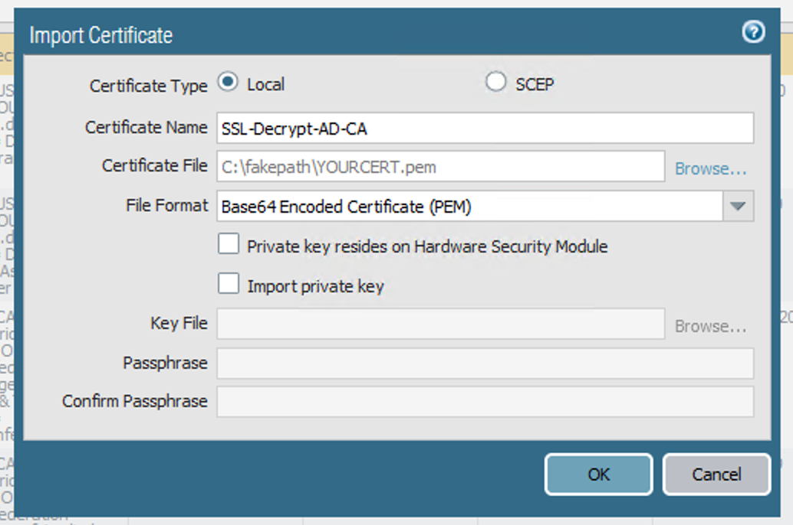
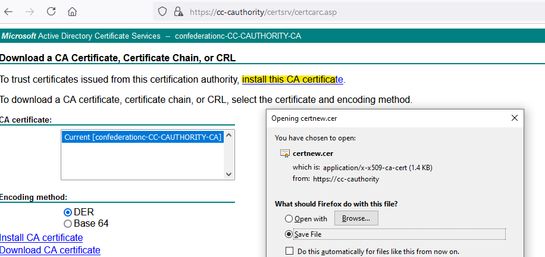
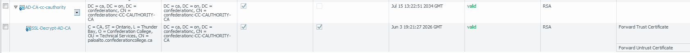

If you have a PaloAlto next-gen firewall and you want to perform SSL decryption on your outgoing traffic, the PaloAlto needs a CA cert so that it can issue its own certificates in order to MITM traffic, and of course your clients need to trust the PA's CA cert so that they trust the certs that it issues.

You could generate a self-signed certificate on the firewall and use Group Policy to import it into your clients' Trusted Root Certification Authorities certificate store, but in my opinion the better option is to issue the firewall a subordinate CA cert from your Active Directory Certificate Services CA. All domain-joined machines already trust your on-prem CA, and thus will implicitly trust the subordinate CA cert.

This article only covers the generation and installation of the subordinate CA certificate. The rest of the SSL decryption configuration is out-of-scope.

1. Generate a CSR on your PaloAlto by going to Device tab -> Certificate Management -> Certificates -> Generate.
2. Enter a certificate name and common name (both are only for your own reference, it doesn't make a difference what they are). From the **Signed by** dropdown choose "External Authority (CSR)", and make sure to check the **Certificate Authority** box:

    

3. Save the resulting CSR to a location accessible from your CA server.
4. On your CA, run the following command as a Domain Admin[^1]:
  ```bash
  certreq -submit -attrib "CertificateTemplate:SubCA" YOUR_CSR.csr
  ```
5. If it worked correctly, it should spit out a .cer file (which will be in the x509 format).
6. Now you need to convert this cert to PEM format using OpenSSL. In my opinion the easiest way to do this is by using WSL (Windows Subsystem for Linux) to run an Ubuntu machine. The command to convert the certificate is 
```bash
openssl x509 -in YOURCERT.cer -outform PEM -out YOURCERT.pem
```
7. Now install the resulting PEM certificate on your firewall by choosing **Import** and then browsing to your PEM cert. Make sure to enter the same certificate name as when you created the CSR so that the PaloAlto links the new cert with the existing CSR:
  
8. If you commit your changes to the PaloAlto now, you'll receive the warning "cannot find complete certificate chain for certificate YOURCERT". The final step is to import your CA's root cert so that the PaloAlto can form the complete certificate chain. Go to https://YOUR-CA/certsrv, and choose to install the CA certificate:

9. Again, we'll need to convert the resulting x509 certificate to PEM:
```bash
openssl x509 -in CAcert.cer -outform PEM -out CAcert.pem
```
10. And import it into your PaloAlto. If everything worked correctly, you should see the two certificates linked in a chain as such:

11. Commit your changes, and you're done! All your ActiveDirectory devices should now trust any certificates issued by your PaloAlto, and you can proceed with configuring SSL decryption.

## References
- https://docs.paloaltonetworks.com/pan-os/8-1/pan-os-admin/certificate-management/obtain-certificates/obtain-a-certificate-from-an-external-ca.html
- https://knowledgebase.paloaltonetworks.com/KCSArticleDetail?id=kA10g000000ClWOCA0

## Questions? Comments?
[Email me!](mailto:jg@justus.ws)

[^1]: If this doesn't work, make sure your user account has permissions on the Subordinate CA certificate template. Open mmc.exe on the CA, go to File -> Add/Remove Snapins, and choose the Certificate Templates snap-in. Check the permissions on the *Subordinate CA* template.
