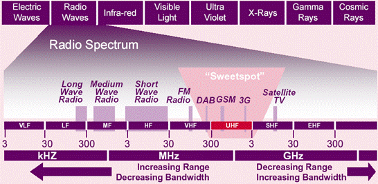
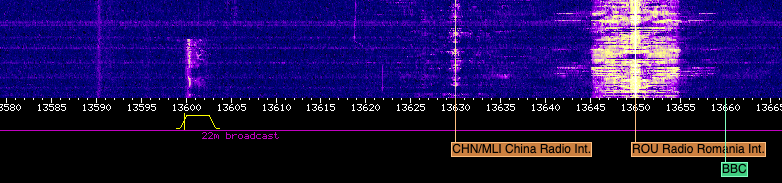
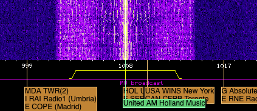
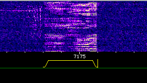
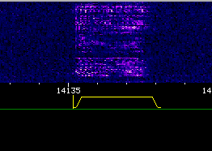
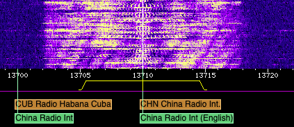

[[toc]]
# Intro

Three days ago I happened across a website posted in an unrelated forum: 

## [http://websdr.ewi.utwente.nl:8901/](http://websdr.ewi.utwente.nl:8901/)

Behind this inauspicious URL hides an entire realm of secrets. It is a gateway to a world that I've only had the vaguest idea of. Let me explain.

The part of the radio spectrum that you're probably most familiar with is 88 &ndash; 108 and 530 &ndash; 1700 MHz: the FM and AM bands that you can receive from your radio in your car or at home. You probably also know that there's a huge usable radio spectrum outside of this. You've heard of HAM radio, shortwave radio, CB, etc. These are all located in areas of the spectrum not receivable by your home radio. Typically, you would need specialized equipment to pick them up: perhaps a HAM radio setup costing thousands of dollars.

## What is SDR?

Now imagine a friend of yours had a radio capable of picking up this wider spectrum of signals. You could go over and listen with her, but the two of you would have to agree what frequency you want to tune the radio to&mdash;you can only listen to one frequency at a time. Enter *SDR*&mdash;"software-defined radio". With SDR, the radio is a computer chip that listens to a huge portion of the radio spectrum and sends the entire signal to the computer it's attached to. Software running on the computer pulls out the frequency it wants. Thanks to this fact, multiple users can use&mdash;and tune&mdash;the radio simutaneously, each to whatever frequency they want.

This brings us pack to the website above: The Amateur Radio Club at the University of Twente in the Netherlands happens to run an SDR, and they have it [hooked up to a public web interface](http://websdr.ewi.utwente.nl:8901/?tune=198AM). This means that anyone in the world can connect to their website and tune the radio to whatever frequency desired. Go ahead, click that link. You'll find yourself listening to the BBC. Except you're listening to the BBC broadcast by a low-frequency high-power transmitter located in Worcestershire, England (originally built in 1934), picked up by an antenna at the University of Twente in the Netherlands, and streamed to you over the internet. Cool, huh?

Note: From here on we're going to be using kHz (kilohertz) instead of of MHz (megahertz) since we'll be discussing frequencies much lower than those received by your home radio. 1 MHz = 1000 kHz.

Their radio can pick up the the Low Frequency range from 30 - 300 kHz that militaries use to communicate with submarines under the ocean. It can pick up the various amateur HAM radio bands scattered between 1800 kHz and 29000 kHz. It can pick up a whole world of commercial and hobbyist AM radio stations that aren't like the ones you can tune into on your home radio. Because of their lower frequency, the signals travel much farther, and there are complicated schedules dictating who is allowed to transmit on what frequency at what times&mdash;so you might find an AM station that only transmits for an hour once a week, and the next hour it's a different station coming from another country on the same frequency. It can pick up coded broadcasts from foreign intelligence agencies.

# Tech Notes

A short overview of some of the technical aspects can be helpful when exploring the SDR. Below are some of the things I've learned over the past couple days&mdash;there may be mistakes. If you're not interested, you can certainly skip ahead to the interesting stuff in the [Discoveries](#discoveries) section.

## *Short*wave?

I was confused at first by the "short" in *shortwave*. Afterall, shorter waves = higher frequency, but we're talking about frequencies much *lower* than those we're accustomed to. Huh? 

The term *shortwave* pre-dates our current high-frequency world of FM radio, television, cellphones, and Wi-Fi. When the term came about, the waves were indeed much shorter than those used at the time.

This graph does a good job of illustrating the spectrum. You can see here that what's called "shortwave" is also HF, or high-frequency. Utwente's web SDR can tune from the bottom of the VLF range to the top of the HF range.

Also note that lower frequencies have a greater range, while higher frequencies can carry more data. This is why technology has trended towards higher frequencies, and why lower frequencies are more fun :)

## The Waterfall

The waterfall display is a visual representation of the radio spectrum, useful for finding and identifying signals. Frequency is on the X axis. Time is on the Y axis, with Y = 0 being the current moment. In other words, new signals appear at the bottom and move up. A lighter color is a stronger signal.

In the example above, there's a strong AM signal on the right at 13650 kHz, a weak AM signal left of that at 13630 kHz, and a USB (Upper Sideband&mdash;see the Modes section next) voice transmission that has just started at 13600 kHz.

## Modes

The mode specifies how the signal is encoded in the radio waves. You're likely familiar with AM (Amplitude Modulation) and FM (Frequency Modulation). AM encodes sound waves by modifying the strength (or amplitude) of the radio wave, while FM encodes sound waves by modifying the frequency (length) of the wave. But there are othes as well:

CW (Continous Wave)

:    A very simple mode that encodes information only by turning the wave off and on. Because of this, it cannot be used to transmit analog voice signals. Often used for morse code.

LSB and USB (Lower Sideband and Uppersideband)

:    These are both forms of AM called Single Sideband. They use half as much bandwidth as AM. With regular AM, there's a carrier signal at the specified frequency, and the information is transmitted both above and below that frequency. In other words, it uses both sidebands. See this AM signal as an example:

The carrier is at 1008 kHz&mdash;this is the frequency you would tune to&mdash;and the information is transmitted in 6 kHz-wide sidebands on both sides of the carrier.

:    In contrast, the Single Sideband modes use only a single sideband: Upper Sideband (USB) transmits information only above the carrier signal, while Lower Sideband (LSB) transmits information below the carrier.

:    Here's an examble of LSB:

The small vertical yellow line represents the carrier signal at 7176 kHz, while the actual information (in this case, an analog voice conversation) occupies a 3 khz-wide sideband below it.

:    And here's a USB signal:

Carrier signal near 14135 kHz with the information occupying a 3 kHz-wide sideband above that.

:    Voice broadcasts almost always use Single Sideband, but there's no rule about whether they use USB or LSB, only tradition and convention. HAMs generally use LSB below 10000 kHz and USB above, while non-HAM voice broadcasts usually use USB. Data transmissions also usually use USB.

AMSync (A.K.A. Syncronous AM)

:    In this mode, the receiver "locks on" to the carrier frequency and replaces the received carrier signal with an artificially generated one. Since it's no longer relying on the received carrier, it can reproduce the received audio with better fidelity. Or something like that. I don't really understand it, but it almost always results in a clearer AM signal. [More information here](https://www.electronics-notes.com/articles/radio/modulation/am-synchronous-demodulation-detection-detector.php).

# Discoveries

A few of the things I've heard over the past three days:

## BBC Radio 4

BBC Radio 4 transmits way down at [198 kHz](http://websdr.ewi.utwente.nl:8901/?tune=198AM) (that's 0.198 MHz). This very low frequency means it can be received over extremely long distances&mdash;the signal comes in crystal clear on this radio in the Netherlands, and can be received across Europe&mdash;and, at night and with good conditions, even on the east coast of the U.S. Unfortunately, it probably [won't be around for much longer](https://www.theguardian.com/media/2011/oct/09/bbc-radio4-long-wave-goodbye).

## Propaganda and signal jamming

China runs a strong shortwave game. They broadcast a station called China Radio International in English and many other languages on hundreds of frequences. I'm surprised by how "Western" the broadcasting sounds. You can see a list of all their stations, times, and languages [here](https://short-wave.info/index.php?station=CHINA%20RADIO%20INTERNATIONAL). They tend to broadcast a much "wider" signal than typical AM stations (e.g. taking up more of the spectrum) which can wipe out other nearby stations.

As an example, here's a typical AM station (United AM at [1008 kHz](http://websdr.ewi.utwente.nl:8901/?tune=1008AMSync), a hobby station out of the Netherlands&mdash;good music, btw!):

And here's China Radio International:

The yellow bar represents the "filter"&mdash; the frequency range that the radio is listening to. In this example, the portions of the signal that are wider than the yellow bar aren't serving any real purpose. Some radios have a wider maximum filter and the greater bandwidth can result in better audio fidelity, and apparently it can also be useful in avoiding interference.

At the same time as they broadcast these wide signals across the spectrum, the Chinese government also actively jams foreign radio signals that they deem undesirable. For example, the United States runs a news agency called [Voice of America](https://en.wikipedia.org/wiki/Voice_of_America) which broadcasts AM stations in 47 languages across the world. VoA was established in 1942, and is certainly considered by some to be propaganda as well. The definition of propaganda just depends on which side you're on, right?

China actively jams the frequencies that Voice of American can be received on inside of China. They do this by using a signal known as [Firedrake](https://www.sigidwiki.com/wiki/Chinese_Firedrake_Jammer)&mdash;an hour long loop of traditional Chinese folk songs broadcast on repeat at a power high enough to override the competing station. A recording of the signal can be heard at that link.

## Numbers Stations

[Numbers Stations](https://people.howstuffworks.com/numbers-stations.htm) are mysterious shortwave broadcasts by goverments across the world, used to communicate with operatives in foreign countries. When you tune into one, you'll hear a voice reading a series of letters and numbers&mdash;a virtually unbreakable code. A schedule of upcoming Numbers Stations broadcasts can be found at [priyom.org](priyom.org), a hobby website run by a group of enthusiasts.

[Here's one I recorded just now while writing this](NumbersStation_E11_2020-08-30T16-24-20Z_7863.0kHz.mp3) on 7863 kHz USB at 1625 GMT. This particular one is an example of the E11 station, broadcast from Warsaw, [believed to be run](https://priyom.org/number-stations/operators/polish-11) by a Polish intelligence agency.

If you want to listen to your own, use the schedule at [priyom.org](https://priyom.org) and tune into the given frequency at the specified time. Keep in mind that the web SDR we're using is located in the Netherlands, so that will affect which stations you're able to hear. You should have good luck with the E11 station, which comes in clear, is pretty frequent, and is in English (as indicated by the "E" in *E11*).

## EAM (Emergency Action Messages)

EAMs are coded messages broadcast by the US Air Force to issue commands to units in the field. Similar to Numbers Stations, they are broadcast in an unbreakable code. Unlike Numbers Stations, they are  broadcast on dedicated frequencies and we know who is responsible for them. They are broadcast on the [High Frequency Global Communications System](https://en.wikipedia.org/wiki/High_Frequency_Global_Communications_System), a network of transmitters across the globe. 

[Here is quite a long one](EAM_message_2020-08-28_1740.mp3) that I recorded on 2020-08-28 at 2240 GMT at 8992 kHz USB. In the beginning of the broadcast, which I didn't catch in the recording, he signals "All Stations". He identifies himself with the callsign "Dungaree".

## "The Buzzer"

UVB-76, also known as "The Buzzer", is a mysterious signal that has been broadcasting from Russia since the early 70s at [4625](http://websdr.ewi.utwente.nl:8901/?tune=4625usb) kHz. Depending on the time of day (which impacts reception), you should be able to hear it yourself by clicking that link. It broadcasts 24 hours a day, consisting usually only of a regularly pulsing buzz. Occasonally a Russian voice interrupts the buzzer. No one knows the purpose of the buzzer&mdash;one theory is that it serves as a Numbers Station, and that the buzzing is only to keep others off the channel when not in use. Another is that it is part of Russia's automated nuclear relatiation system&mdash;if the buzzing ever ceases, it would be a sign that the Russia is under attack and nuclear relatiation is automatically triggered. Good information in [this BBC article](https://www.bbc.com/future/article/20170801-the-ghostly-radio-station-that-no-one-claims-to-run).

[Here is a short recording](The-Buzzer_2020-08-30T17-09-30Z_4625.0kHz.mp3) I just made.

## AM Music Stations

There are thousands of AM stations that broadcast on various frequencies at different times. I've listened to Jay-Z broadcast from Germany. I've listened to The Doors broadcast from The Netherlands. I've heard traditional Chinese and Mongolian folk music. One of my favorite stations is [1008 kHz AM](http://websdr.ewi.utwente.nl:8901/?tune=1008AMSync) &mdash; United AM, a hobby station in Holland. They don't even have a website, just a [Facebook page](https://www.facebook.com/United-am-1008khz-298m-2046008235620711/). They're playing Crash Test Dummies as I listen now. I'm not sure what their schedule is, but they've been broadcasting every time I've tuned in.

I also like Absolute Radio at [1215 kHz](http://websdr.ewi.utwente.nl:8901/?tune=1215AM), Radio Mi Amigo International at [3985 kHz](http://websdr.ewi.utwente.nl:8901/?tune=3985AM) (M-F, 1700-1800 GMT) and [6085](http://websdr.ewi.utwente.nl:8901/?tune=6085AM) (7 days/week, 0700 - 1700 GMT), and shortwaveradio.de at [3975 kHz](http://websdr.ewi.utwente.nl:8901/?tune=3975AM) (7 days/week, 0700 - 2200 GMT).

[short-wave.info](https://short-wave.info/index.php) is a great resource for finding the schedules and frequences of stations. Keep in mind that the radio we're using is located in the Netherlands - pay attention to the location of the transmitting station to determine whether you'll be able to get a clear signal. If you set your location, short-wave.info will show you the estimated signal strength. Shortwave signals don't travel well between night and daytime. In other words, when it's daytime in the Netherlands, you'll get a better signal from transmitters that are also in the daylight, and vice versa for nighttime. 

## Amateur Operators (HAM radio)

[In this recording](USA-to-Slovenia_2020-08-30T21-15-31Z_14240.0kHz.mp3) I made at 21:13 GMT on 2020-08-30 at 14240 kHz, we can hear someone with callsign [S51DX](https://www.qrzcq.com/call/S51DX) (Slovenia) hailing someone in North America with the callsign [KD8XK](https://www.qrzcq.com/call/KD8XK) (West Virginia). On our end we can only just barely hear the response from North America, but it's there. Trans-Atlantic communication!

You can find countless amateur radio transmissions in the Amateur bands, helpfully indicated in Green in the Web SDR.

## Digital Pirates

If you hang out in the chat long enough at http://websdr.ewi.utwente.nl:8901 you'll see people pointing out pirates: unauthorized broadcasters on unadvertised frequencies. Usually just playing music, they're fun to find and listen to.

# Additional Resources

[Signal ID Wiki](https://www.sigidwiki.com)

:    A resource for identifying various types of signals, both from their waterfall display and audio.

[short-wave.info](https://short-wave.info/)

:    A great resource for finding and/or identifying shortwave AM stations based on the broadcast time and frequency. If you set your location correctly (remember, we're receiving from the Netherlands), it will show you estimated signal strength as well.

[MWLIST](https://www.mwlist.org/mwlist_quick_and_easy.php)

:    Covers lower frequencies than short-wave.info, but not as easy to use.

[RTL-SDR.com](https://www.rtl-sdr.com/)

:    Resources for setting up your own SDR, as well as much more. They also sell one of the most popular budget SDRs ($25), the RTL-SDR.

[priyom.org](https://priyom.org/)

:    Schedule and information on Numbers Stations.

The chatroom at http://websdr.ewi.utwente.nl:8901

:    One of the best things about Utwente's web SDR is the accompanying chatroom on the same page. Much of what I've learned so far is from that chatroom, and the people who hang out there are very gracious, patient, and helpful. Thank you!

# Further Explorations

The web SDR at the University of Twente is just the beginning&mdash;there's a whole world (literally) of internet-connected SDRs that you can access and listen to. The [KiwiSDR](http://kiwisdr.com/) project is great for this. A map of all public KiwiSDRs [can be found here](http://rx.linkfanel.net/). Just click on them to connect!

# Questions? Want to let me know about a mistake I've made? Share your own discoveries?

[Email me](mailto:jg@justus.ws)!
