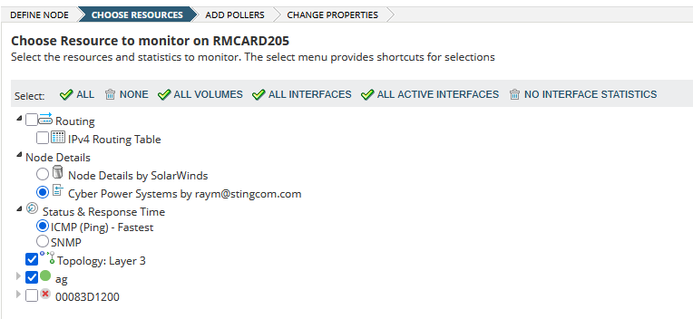
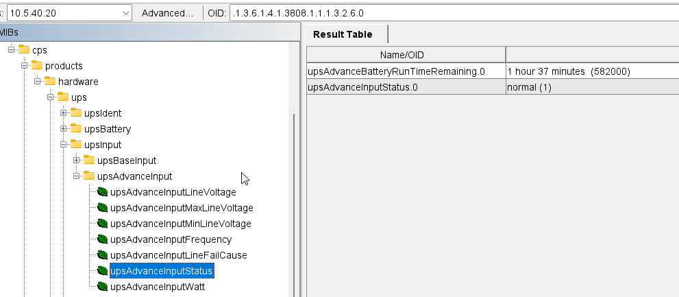
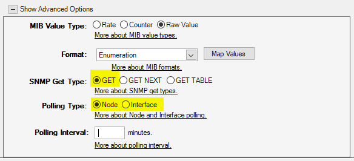
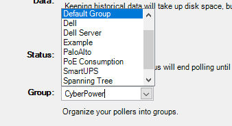
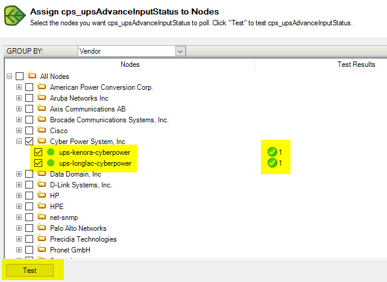
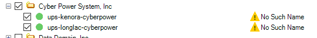
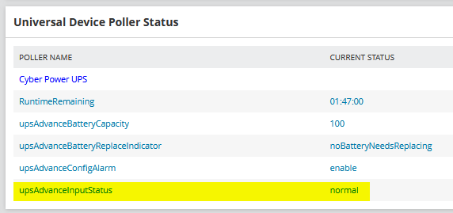
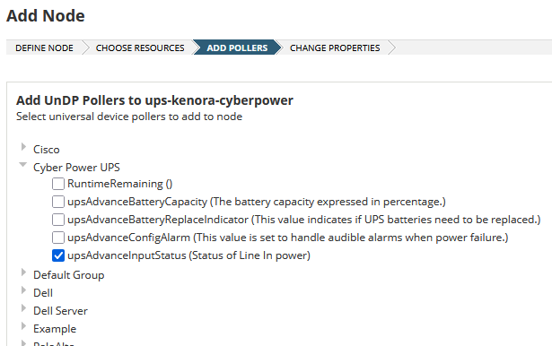

Say you're me and you've got some fancy new CyberPower UPSs and you want to monitor them with Solarwinds NPM. 

This guide is written using a CyberPower UPS as an example, but it applies to any device with SNMP attributes that you would like to monitor in Solarwinds.

You go ahead and add them to Solarwinds, and you see...not much:

Where's the battery runtime? Where's the input status? How do I send an alert if it goes on battery or when the battery needs to be replaced?

Each one of these values is identified by an SNMP OID, which is a string that looks like ` 1.3.6.1.4.1.3808.1.1.1.2.2.4`, and can be fetched by creating a "Universal Device Poller" in Solarwinds.

The first step is to find the OID that represents the value we're looking for. This requires two things: 

1. A MIB file, usually provided by the device vendor[^1], which is a database containing all the OIDs that the device supports
2. A MIB browser, which can load the MIB file, connect to the device, and fetch the corresponding values via SNMP. I'm currently using [MIB Browser from iReasoning](https://www.ireasoning.com/mibbrowser.shtml). It's not perfect (it doesn't support SNMPv3, and the interface is a little odd), but it works.

Once you've got this, go ahead and load the MIB file into your MIB browser, plug in your device's SNMP info, and then expand the MIB tree:

How the tree is structured will vary depending on the MIB browser that you're using, but ultimately you're looking for a node called "enterprises", under which you should find your device vendor. In the case of iReasoning's MIB Browser, it's MIB Tree -> iso.org.dod.internet -> private -> enterprises, and "cps" stands for "Cyber Power System", in my case. To provide a different example, in ManageEngine's MibBrowser, each loaded MIB file shows up as a separate top level node, and in this case it's "CPS-MIB" (again, for Cyber Power System) -> enterprises -> cps:

Under the vendor's node, the structure and content will vary significantly, but from this point on its just a matter of poking through the children nodes to find the value's you're looking for. Back to my Cyber Power UPS, we find the remaining runtime under cps -> products -> hardware -> ups -> upsBattery -> upsAdvanceBattery -> upsAdvanceBatteryRunTimeRemaining:

And the current line input status under cps -> products -> hardware -> ups -> upsInput -> upsAdvanceInput -> upsAdvanceInputStatus:

When you select the item, in addition to seeing the current value on the right, you'll also see some very important information at the bottom. This is what we need for Solarwinds --- particularly the OID (although the Syntax field will also come in handy):

Now we need to log into our Solarwinds server (via RDP), and launch the local program "Universal Device Poller": 

It should be in your Start Menu under the "SolarWinds Platform" folder, but otherwise you can find it at "C:\Program Files (x86)\SolarWinds\Orion\UniversalDevicePoller.exe".

Click **New Universal Device Poller** at the top, and then paste in the OID from your MIB browser[^2]. You'll need to remove the prepending `.`, if there is one. Also ensure that there's no space before the OID --- that will result in a "The UID is not supported" error later. Optionally, if the OID does not already end in `.0`, add it. This is not always required, but sometimes without it Solarwinds will return a "No such name" error when polling the OID, and adding it never seems to hurt.[^3]

Enter a **Name** and **Description**; you can choose your own, or copy the values from your MIB browser.

Next we set the object type, format, and polling type:

Most of the time, you'll be fine with a **MIB Value Type** of "Raw Value" and a **Format** of "Text". In the case of upsAdvanceInputStatus, it returns an integer representing a value, and choosing "Text" would just return the integer. Instead, we can choose "Enumeration" which allows us to map a value to each integer, which will then be displayed in Solarwinds. Your MIB browser should be able to show you what each integer represents (this information is present in the MIB file): 

We'll hit the **Map Values** button, and copy them in (press `Enter` to create new rows):

Next we'll set **SNMP Get Type** to "GET" (unless you know you need "GET NEXT" or "GET TABLE"), and the **Polling Type** to "Node" or "Interface" depending on whether the value is specific to the node as a whole or to a particular interface on the node. You can also set **Polling Interval** (if left empty, the default value set in your NPM settings will be used):

Finally, you'll probably want to set a custom group to organize this poller into. If the group you want doesn't already exist, the dropdown menu is also a textbox that you can just type into:

On the next page, if desired you can assign the new poller to existing nodes, and also test the poller against real nodes to verify it returns the expected data:

Note that if even if you've set an Enumeration value table, the raw integer value will be displayed here, *not* the translated value.

If you receive the error "The UID is not supported", double-check the OID that you've entered---often, I inadvertently have a space before the OID. Also make sure you've selected "GET" and not "GET NEXT" for the **SNMP Get Type**.

If you receive the error "No Such Name", try adding a `.0` to the end of the OID.

Once you've added the custom poller, if you assigned it to any existing nodes during the creation, you should now see the values in Solarwinds NPM if you browse to the node's details:

Note that the translated value from the Enumeration Map Values table is displayed---this is the value that you'll need to use for any other actions (Alerts, SWQL, etc) within NPM.

When adding a new node or editing an existing node in NPM, you'll be able to choose your new custom poller:

# Commends, Questions, or Corrections?

Email me! jg@justus.ws

[^1]: If you can't get a MIB file for your device, I believe it is also possible to gather all of the OIDs directly from the device itself through an "SNMP walk". That is beyond the scope of this article.
[^2]: You may notice the "Browse MIB Tree" button. This is where I spill the beans that you might not actually need to use a third-party MIB browser as instructed previously, because Solarwinds has this functionality built in. *However*, it only works if the MIB data for the device you're polling already exists in Solarwinds MIB database. Even if you have the MIB file from the vendor, there's no way to add it to the Solarwinds MIB database (although Solarwinds Support can add it for you).

    Additionally, I usually find it easier to just use a third-party MIB browser anyway. Because the Solarwinds MIB database contains thousands of vendors, it can be difficult finding the correct one for the device you're adding.

[^3]: If you know SNMP and can explain this to me, email me at jg@justus.ws.

