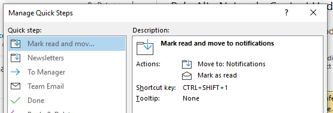
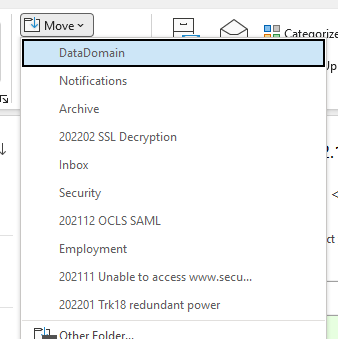

Unfortunately, this is not a solution, only a complaint about a very annoying thing: moving emails to different folders in Outlook for Windows is a PITA. If you're quickly moving through your inbox triaging and organization emails, for efficiency's sake you don't want to use the mouse. No clicking and dragging emails to folders (and if you have dozens of folders you can't do that anyway without scrolling to find the folder you want).

For moving emails using the keyboard, you have three options:

1. Use Quick Steps to assign keyboard shorcuts to move emails to a *specific* folder. E.g. you assign the keyboard shortcut "Ctrl-Shift-1" to move the selected email to your "Projects" folder, "Ctrl-Shift-2" to move the email to your "Completed" folder, and so on. This is by far the fastest method, *but you can only use the keyboard shortcuts Ctrl-Shift-1 through Ctrl-Shift-9,* meaning that if you have more than nine folders you're out of luck. Also you have to remember the shortcut for each folder.

2.  The key sequence Alt -> H -> MV will open the "Move" dropdown, which shows you the 10 most recently used folders, which you can then use the arrow keys to select. This can be useful for recently used folders, but if the folder you're looking for isn't there you're out of luck.

3.  "Ctrl-Shift-V" opens the "Move Items" dialog box. Theoretically you can start typing the first few letters of the folder's name to jump to it, but this will not work if the folder is inside another folder which is collapsed.

## Adding salt to the wound
If that wasn't bad enough, *this works perfectly on Outlook for Mac*, which has a keyboard shortcut for fuzzy finding the target folder. Simply press "Shift-Command-M", start typing *any part of the folder's name*, and press enter when the folder you want is selected.

I can only hope this behavior is coming to Outlook for Windows soon, but I'm not [holding my breath](https://www.msofficeforums.com/outlook/41497-moving-messages-folders-typing-folder-name.html).

## Comments
Are you annoyed too? Did I miss something and you miraculously have a solution for me? Please [email me](mailto:website@justus.ws)!
