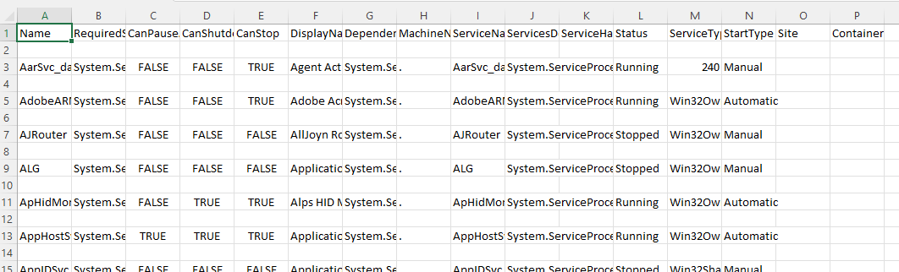
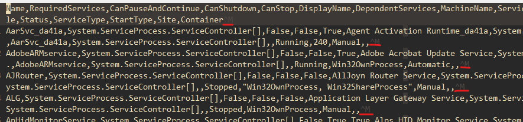

If you're using the excellent VisiData on Windows, like I am, you may have noticed that that if you save a CSV from VisiData and open it in Excel, you'll end up with annoying blank lines between each line:



If you open the file in Vim, you'll notice there's a "^M" (Ctrl-M) character at the end of every line:



This is because VisiData outputs a carriage return character in addition to the line break, which Excel doesn't like.

To prevent VisiData from doing this, create a new empty text file at `~\.visidatarc` (That's in your profile folder, e.g. `C:\Users\justus\.visidata`) and add the following line:

```md
options.csv_lineterminator = '\n'
```
