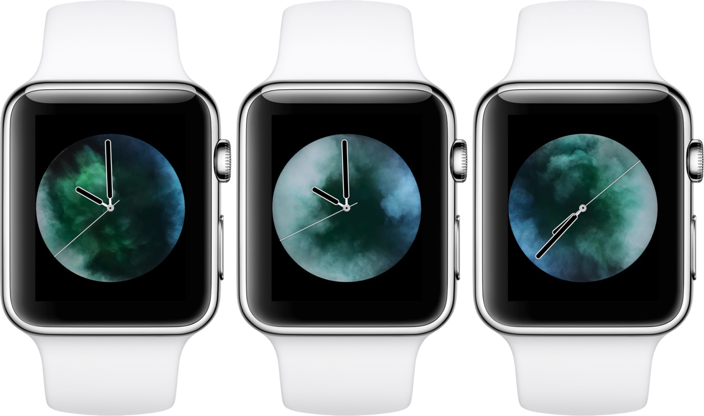

In spring of 2020, I was holed up with Caroline at her appartment in Thunder Bay having crossed the border just before the closure. It was a weird and stressful time. We didn't know how the pandemic was going to play out, or if the world was coming to an end. We were carefully disinfecting all of our groceries after shopping and making masks from scratch. For the first two weeks, I was in quarantine and couldn't so much as step out into the hallway of the building, much less go outside. I was working remotely and having trouble focusing on work.

It was a weird, stressful time, but also oddly cozy. We were living together for the first time in our already long relationship. We had time to spend on sewing projects. When we did venture out to brave the grocery stores, we always went together.

By then Tawny was on her last legs and couldn't make it through the night without soiling her bed. Every night around 2am I would get up, carry her down two flights of stairs, wait outside with her while she went to the bathroom, and carry her back to bed.

I had recently gotten an Apple Watch and was using the "Vapor" watchface --- an animation[1] of blue and green smoke swirling together and bouncing off the edges of the watch. I don't have the watch anymore and haven't been able to find a good video of it online, but it looked like this:

For some reason, my most visceral memory of this time is waking up in the night to that captivating, soothing animation[^2]. It evokes a strange nostalgia for a time that was both turbulent and calm, complicated and simple.

## Footnotes
[^1]: I was always slightly disappointed that it was a static animation and not dynamic and random, but I just learned the reason for that: the effects are [physically created and recorded](https://youtu.be/aK7KPw9bLfI?si=1MjmqjG-asBjtufu&t=28).

[^2]: The stunning [Dlp 1.1](https://www.youtube.com/watch?v=DXU3_PgX8qQ) from William Basinski's *Disintegration Loops* is a near-perfect analog of the feeling this watch face evokes for me.